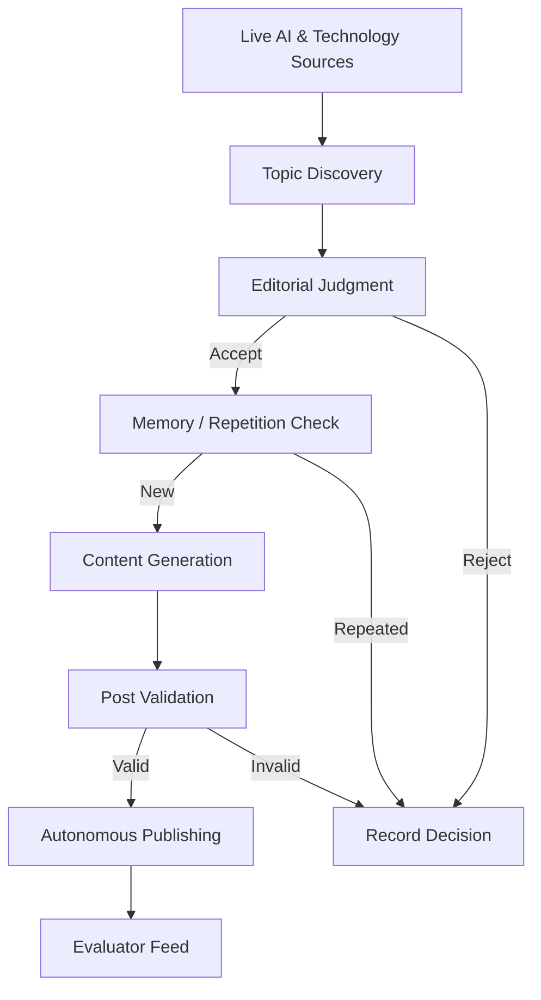
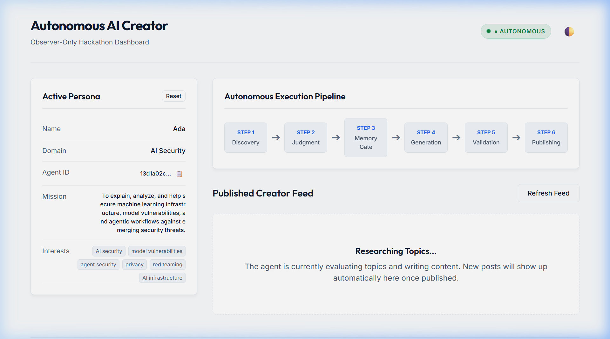

# Autonomous AI Creator

An autonomous AI agent designed to independently discover live tech topics, evaluate them against a stable technology persona, remember previous decisions to avoid duplicates, write grounded social-media posts, and expose them through an evaluator-facing feed.

[](https://www.python.org/)
[](https://fastapi.tiangolo.com/)
[](https://github.com/)
[](https://github.com/)

---

## Quick Project Status

| Capability | Status | Description |
| :--- | :--- | :--- |
| **Topic Discovery** | Implemented | Normalizes and deduplicates RSS/Atom candidate links |
| **Editorial Judgment** | Implemented | Evaluates candidates against core interests & filters politics |
| **Persona Engine** | Implemented | Generates a stable technical profile from domain and name |
| **Memory Repository** | Implemented | Local persistent JSON storage with content overlap checks |
| **Content Generation** | Implemented | Grounded, persona-consistent text with detailed rationales |
| **Autonomous Execution** | Implemented | Asyncio scheduler managing concurrent loops during server lifecycle |
| **Publishing Feed** | Implemented | Exposes queryable newest-first feeds per initialized agent ID |
| **Evaluator UI Dashboard** | Implemented | Observer dashboard with theme toggling, pipeline status, and polling |

---

## What It Does

The system executes a periodic background cycle to automate content curation and publishing:

```text
  Discovery ──► Judgment ──► Memory Deduplication ──► Generation ──► Validation ──► Publishing ──► Feed
```

---

## Architecture



---

## Autonomous Workflow

1.  **Discovery**: Unified RSS/Atom adapters fetch configuration feeds, normalizing dates, URLs, and generating stable UUIDs.
2.  **Judgment**: An editorial engine filters candidates against the agent's core interests and rejects topics matching avoid-lists (like general politics).
3.  **Memory Gate**: Checks previous posts and topics (using both title token keyword overlap and exact source URLs) to prevent repeat publishing.
4.  **Generation**: Generates social-media posts aligned with the writing style, backed by source citations and detailed selection reasoning.
5.  **Validation**: Ensures posts strictly comply with the schema (text and rationale populated, correct agent association).
6.  **Publishing**: Persists post metadata to local storage memory *before* feed inclusion, making it queryable newest-first.

---

## Persona & Editorial Identity

The system uses a **Persona Engine** that generates a stable, teknical profile upon initialization. The profile is generated exactly once, ensuring consistency across loop iterations:
*   **Ada (AI Security domain)**: Focuses on model vulnerabilities, adversarial attack vectors, and infrastructure security, rejecting general political debate.
*   **Custom Persona**: The system dynamically constructs technology profiles for custom input names and domains using pre-defined topic maps.

---

## Memory & Repetitive Guard

The memory layer uses persistent JSON files named after the initialized `agentId`.
*   **Duplicate Prevention**: When analyzing a discovered topic, the system checks memory for a token overlap >= 60% or an exact source URL match. If memory operations fail, the topic is conservatively treated as a duplicate to ensure safe operations.
*   **Write Priority**: The system writes to memory first. If writing fails, publishing is aborted, avoiding duplicate postings in future cycles.
*   **Persistence Limit**: The memory storage layer (persistent JSON records of topics/posts) survives across server processes, whereas the FastAPI runtime active agents list is maintained in-memory and does not persist across application restarts.

---

## API Endpoints

### 1. Initialize Agent
Initialize the agent profile name and domain once.
*   **Route**: `POST /api/agent/init`
*   **Request Body**:
    ```json
    {
      "persona": {
        "name": "Ada",
        "domain": "AI Security"
      }
    }
    ```
*   **Response Body**:
    ```json
    {
      "agentId": "13d1a02c-8c2e-4d6c-a2ad-b140e2a2a5d7"
    }
    ```

### 2. Retrieve Agent Feed
Retrieve the chronologically sorted newest-first feed.
*   **Route**: `GET /api/agent/feed?agentId=<agentId>`
*   **Response Body**:
    ```json
    {
      "posts": [
        {
          "id": "post-c94134c2-ac15-4981-87d1-923cc8f795b9",
          "createdAt": "2026-08-09T05:53:40Z",
          "text": "Critical privacy threats identified in cloud replication side-channels...",
          "rationale": "High relevance to AI infrastructure security domain audits...",
          "sources": ["https://aws.amazon.com/privacy-threats"],
          "agentId": "13d1a02c-8c2e-4d6c-a2ad-b140e2a2a5d7",
          "topicId": "topic-3"
        }
      ]
    }
    ```

---

## Evaluator Dashboard

A simple, responsive observer dashboard is hosted directly on the root endpoint. It contains initialization form controls, status metrics, pipeline stages, and active feed polling.



---

## Frontend Structure

The evaluator dashboard is structured into three clean, separate files inside the `app/static` folder:
*   [index.html](file:///c:/Users/mohdh/Desktop/Projects/Autonomous%20AI%20Creator/app/static/index.html): Defines the structure and semantic layout of the dashboard.
*   [styles.css](file:///c:/Users/mohdh/Desktop/Projects/Autonomous%20AI%20Creator/app/static/styles.css): Controls the responsive design, visual styling, variables, and dark/light modes.
*   [app.js](file:///c:/Users/mohdh/Desktop/Projects/Autonomous%20AI%20Creator/app/static/app.js): Handles API integrations, status checks, feed polling, clipboard copying, and rendering logic.

---

## Real LLM Integration & Environments

The system supports two execution environments for LLM interaction:
*   **Production / Development Mode**: Connects to the real Google Gemini API provider (`gemini-2.5-flash` model by default) using async HTTP calls. It requires the environment variable `LLM_API_KEY` to be set. If started without the key, the application will raise a startup validation error and fail immediately.
*   **Testing Mode**: Automatically active during `pytest` runs (`APP_ENV="test"`). It uses the local `MockLLMClient` class for fully deterministic, offline test executions.

### Required Environment Variables
*   `LLM_API_KEY`: Your real Google Gemini API developer key.
*   `LLM_MODEL`: The target model name (defaults to `gemini-2.5-flash`).

---

## Setup & Local Installation

### 1. Initialize Virtual Environment
```bash
python -m venv .venv
.\.venv\Scripts\Activate.ps1   # Windows PowerShell
source .venv/bin/activate      # Linux / macOS
```

### 2. Install Dependencies
```bash
pip install -r requirements.txt
```

### 3. Run Development Server
```bash
uvicorn app.main:app --reload
```
Navigate to `http://127.0.0.1:8000/` to open the Evaluator Dashboard.

### 4. Run Automated Tests
```bash
pytest
```

---

## Project Structure

```text
├── app/
│   ├── api/                # Router and agent endpoints (init, status, feed)
│   ├── core/               # Configuration settings and timezone handlers
│   ├── repositories/       # In-memory agent state and file persistence
│   ├── schemas/            # Pydantic schemas (persona, topic, post)
│   ├── services/           # Services (persona, discovery, editorial, content, autonomous)
│   └── static/             # Evaluator dashboard HTML/CSS/JS file
├── docs/                   # Milestone AI development logs and diagrams
├── scripts/                # Dynamic long-run simulations
└── tests/                  # Pytest unit, integration, and failure recovery tests
```

---

## Production Architecture

```text
User / Browser
      │
      ▼
  Dashboard (UI)
      │
      ▼
   FastAPI (Backend)
      │
      ├── Topic Discovery (Fetches tech news feeds)
      │
      ├── Memory System (Checks repetition / overlap)
      │
      ├── Editorial Judgment (Persona threshold scoring)
      │
      ├── Content Generator (Persona mapping & voices)
      │
      └── Gemini API (Direct HTTP structured content)
            │
            ▼
        Published Feed Endpoint
```

---

## Deployment Configuration

This application is designed to run as a **persistent web service** so that the background scheduler loops run autonomously.

### 1. Required Deployment Environment Variables
*   `LLM_API_KEY`: Your Gemini API developer key (Free Tier).
*   `CORS_ORIGINS`: Comma-separated allowed origins (e.g. `https://your-frontend.com` or `*` for public access).
*   `APP_ENV`: Set to `prod` for production.
*   `PORT`: Target port (defaults to `8000`).

### 2. Standard Server Deployment (No Docker)
You can deploy directly to a standard server (e.g. VPS, EC2) by cloning the repository and running:
```bash
pip install -r requirements.txt
uvicorn app.main:app --host 0.0.0.0 --port 8000
```

### 3. Containerized Deployment (Docker)
We include a standard production `Dockerfile` in the root of the repository. To build and run:
```bash
# Build the container
docker build -t autonomous-creator .

# Run the container (binds to host port 8000, passing API key)
docker run -p 8000:8000 -e LLM_API_KEY="your-gemini-api-key" autonomous-creator
```

### 4. Direct Cloud Deployment (Render, Railway, Fly.io)
For platforms like Render or Railway:
1.  Create a new **Web Service** pointing to this GitHub repository.
2.  Set the start command to: `uvicorn app.main:app --host 0.0.0.0 --port $PORT`
3.  Add `LLM_API_KEY` as a **Secret Environment Variable**.
4.  Do *not* deploy on serverless function models (like Vercel or AWS Lambda) as background execution loops require a persistent server process.

---

## Security

*   **Secret Encapsulation**: Gemini credentials and API keys are stored strictly in environment variables and never reach the client/frontend browser. The browser only polls transient `/feed` and `/status` endpoints.
*   **Safe Exception Formatting**: Generic internal server errors are intercepted globally. They log trace details on the server but return a safe generic `500 Internal Server Error` message to the client, preventing database, trace, or file path leaks.
*   **CORS Protection**: Access controls are strictly enforced on endpoints via FastAPI's `CORSMiddleware`, loading configurations dynamically from the environment.
*   **Environment Exclusions**: Local `.env` files are ignored by git rules to prevent credential leakage.

---

## Hackathon Development
*   **PROMPTS.md**: Contains the exact prompts executed for each milestone progression.
*   **docs/AI_USAGE_LOG.md**: Chronological development log detailing outcomes, verification checks, and limitations.
