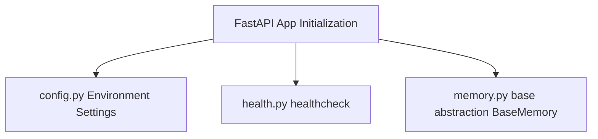
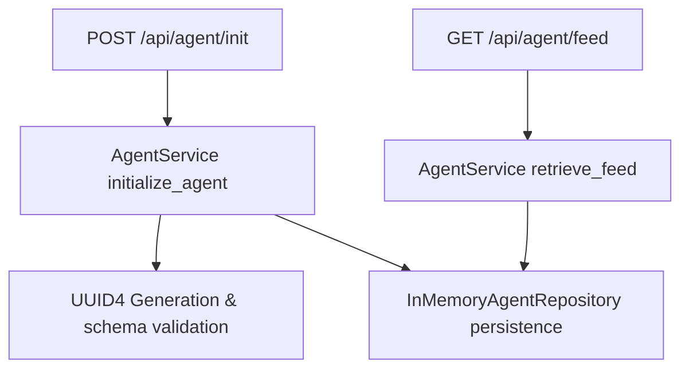
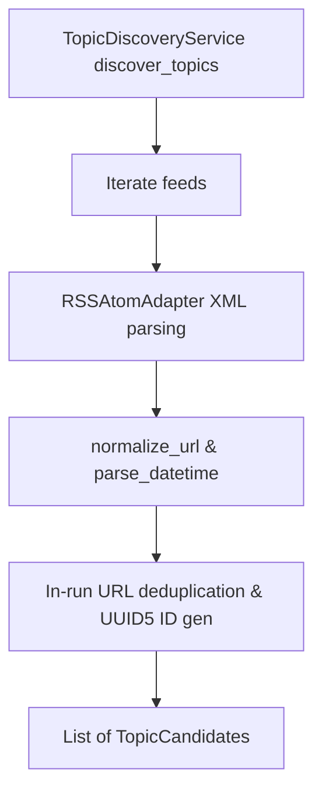
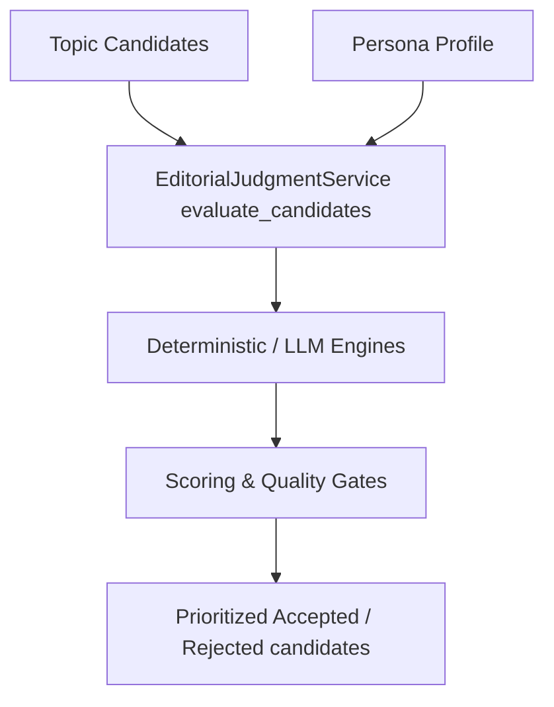
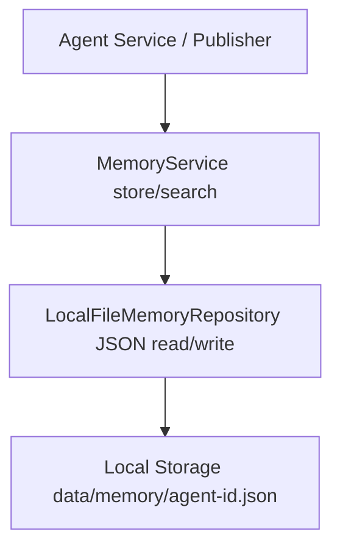
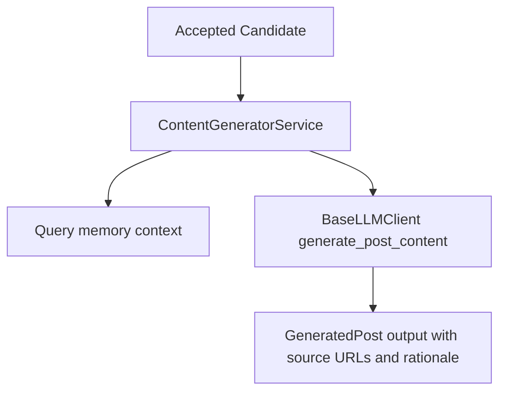
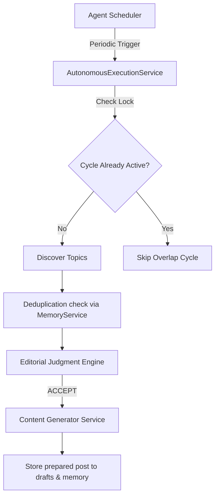

# AI Usage Log

> **Autonomous AI Creator · Hackathon Development Record**

This document records the AI-assisted development process used to build the Autonomous AI Creator.

The project was developed incrementally through independently scoped milestones. Each milestone introduced a specific capability, was verified independently, documented, and committed to Git.

This document serves two purposes:
1. **Engineering record** — showing how the system evolved.
2. **Authenticity record** — preserving the relationship between coding-agent prompts, implementation decisions, verification, and Git history.

---

## Development Philosophy

The Autonomous AI Creator was intentionally built as a sequence of small, testable capabilities rather than as a single generated codebase.

```text
  M1: Foundation & Memory Abstraction
                  │
                  ▼
  M2: Agent Initialization & Feed API
                  │
                  ▼
      M3: Stable Persona Engine
                  │
                  ▼
     M4: Live AI Topic Discovery
                  │
                  ▼
      M5: Editorial Judgment Engine
                  │
                  ▼
       M6: Persistent Agent Memory
                  │
                  ▼
       M7: Autonomous Content Generation
                  │
                  ▼
       M8: Autonomous Execution Loop & Scheduling
                  │
                  ▼
       M9: Autonomous Publishing & Feed Integration (Planned)
                  │
                  ▼
      M10: Memory integration via Breeth (Planned)
```

Each milestone has its own scope, verification, documentation, and Git history. Planned milestones will connect editorial judgment with persistent memory, content generation, and autonomous scheduling.

---

## Milestone Overview

| Milestone | Capability | Primary Outcome | Git Commit Hash & Message |
| :--- | :--- | :--- | :--- |
| **M1** | Foundation | Project architecture and development foundation | `f6540e977f92edf0d4212103bd925b9e66bc5863`<br>`chore: initialize autonomous creator project` |
| **M2** | Agent API | Initialization and feed contract endpoints | `5b192df82eb6b579128899bede221f518397c74d`<br>`feat: implement agent initialization and feed API` |
| **M3** | Persona | Stable AI identity and editorial profile generation | `e7622f7cf45e3f634017b03258ede6e7284cf9d2`<br>`feat: add stable AI persona engine` |
| **M4** | Discovery | Live AI/technology topic discovery | `845046010a96f177df3eb408bb8f67f441ee22d2`<br>`feat: add live AI topic discovery` |
| **M5** | Editorial Judgment | Persona-aware topic selection and scoring | `ef6d57cad3e21870a20da42efa44513b8da0d6de`<br>`feat: add persona-aware editorial judgment` |
| **M6** | Persistent Agent Memory | Local persistent agent-scoped memory & repetition checks | `c20c589a803890afdbb4741ceddd54e91722bec7`<br>`feat: add persistent agent memory` |
| **M7** | Content Generation | Persona-consistent post text grounded in sources | `bdb265a657579875c1e27216423394c18deb45a7`<br>`feat: add autonomous content generation` |
| **M8** | Scheduling Loop | Periodic autonomous cycle execution, states, locks, failure resilience | `9b6825f30322219804d38dafca4eaf810894f278`<br>`feat: add autonomous execution loop` |
| **M9** | Autonomous Publishing | Connected background loops to the evaluator feed API, validation, sorting | `0e9c784`<br>`feat: implement autonomous publishing feed` |
| **M10** | Autonomous Reliability | Safe fault-isolation, bounded retries, priority writing, and recovery | `0f04749`<br>`feat: improve autonomous reliability and recovery` |
| **M11** | Evaluator UI & Polish | Polished observer dashboard, theme toggles, Mermaid diagram fixes | `bb9003c`<br>`feat: add evaluator dashboard and polish documentation` |
| **M12** | E2E Hardening & Cleanup | Time-based simulation script, separated frontend assets, key review | `feat: harden autonomous runtime and evaluator flow` |

---

## M1 · Foundation

**Status:** Complete  
**Focus:** Project foundation and architecture  
**Commit:** `f6540e977f92edf0d4212103bd925b9e66bc5863` · `chore: initialize autonomous creator project`  
**Date:** 2026-08-08  

### Objective

Establish the initial project foundation, FastAPI service layout, environment settings validation, memory abstraction interface, and health check validation.

### Scope Boundaries

> **Implemented:** Base FastAPI app layout, settings validation via `pydantic-settings`, healthcheck API (`GET /health`), abstract memory interface contracts.  
> **Deferred:** Agent state management, live topic discovery, editorial judgment, content writing, scheduling, publishing.

### Coding-Agent Prompt

> The exact original coding-agent prompt could not be recovered from the available repository history.

### Verified Reconstruction

Based on the implementation and Git history, this milestone focused on establishing the base FastAPI project structure, setting up environmental settings management with Pydantic, exposing a GET `/health` endpoint, defining the abstract `BaseMemory` interface, and verifying functionality using automated tests.

*Note: The subsequent prompt received for reviewing and committing Milestone 1 was:*

<details>
<summary><strong>View review prompt</strong></summary>

```text
Before we continue to the next milestone, perform a final review of the work completed in Milestone 1.

Do NOT add new application features.

### Review

Inspect the entire repository and verify:

* project structure is clean and logical
* no duplicate or unnecessary files exist
* no secrets or credentials are committed
* dependencies are justified
* README accurately describes the current state
* `.env.example` contains no real secrets
* tests pass
* the application starts successfully
* `/health` works
* the Breeth setup/test has not been falsely represented as an implemented application feature
* the code is reasonably modular for future milestones

Also verify that `docs/AI_USAGE_LOG.md` exists. If it does not exist, create it and record the actual Milestone 1 coding-agent work. Do not invent details that were not part of the work.

### Git

Check the Git diff and Git status carefully.

Only stage files that belong to Milestone 1.

Do NOT stage:

* secrets
* `.env` files containing credentials
* virtual environments
* caches
* generated temporary files
* unrelated files

Run the relevant tests one final time.

Then create a meaningful conventional commit for this milestone.

Use this commit message unless there is a compelling reason to improve it:

`chore: initialize autonomous creator project`

After committing, report:

1. Git commit hash
2. Commit message
3. Files included in the commit
4. Test result
5. Final project structure
6. Any files intentionally excluded
7. Current Git status
```

</details>

### What This Prompt Does

This prompt instructs the coding assistant to finalize Milestone 1 by checking repository structure cleanliness, ensuring dependencies and configurations are secure, testing FastAPI health endpoints, verifying the memory abstraction (`BaseMemory`), creating `docs/AI_USAGE_LOG.md`, and initiating the Git commit workflow. It imposes thin route layout constraints and explicitly defers state management, agents, LLMs, and publishing.

### Architecture Snapshot



### Implementation

* **Environment Initialization**: Configured `.gitignore` for virtual environment (`.venv`), python caches, and `.env` files. Defined required packages inside `requirements.txt` and template settings in `.env.example`.
* **API Layout**: Configured central FastAPI application entry point `app/main.py`, sub-routing controller `app/api/router.py`, and health router `app/api/endpoints/health.py`.
* **Settings Management**: Implemented `Settings` class in `app/core/config.py` loading configurations securely using `pydantic-settings`.
* **Memory Abstraction**: Created `BaseMemory` abstract base class and `BreethMemoryPlaceholder` throwing `NotImplementedError` inside `app/services/memory.py` to draft persistent memory integration contracts.

### Verification

* **Deterministic Unit Tests**: Created `tests/conftest.py` supplying `TestClient` pytest fixtures, and wrote `tests/test_health.py` validating health checks return HTTP 200 with matching environment metadata. All tests passed.
* **Regression Suite**: N/A (Milestone 1).
* **Manual Verification**: Development server starts up cleanly and answers queries on port 8000.

### Outcome

Milestone 1 foundation established, verified, and documented.

### Deviations

None.

---

## M2 · Agent Initialization & Feed API

**Status:** Complete  
**Focus:** API contract and in-memory agent initialization  
**Commit:** `5b192df82eb6b579128899bede221f518397c74d` · `feat: implement agent initialization and feed API`  
**Date:** 2026-08-08  

### Objective

Implement the hackathon API contract endpoints (`POST /api/agent/init` and `GET /api/agent/feed?agentId=<id>`), validate inputs, and store basic agent initialization state.

### Scope Boundaries

> **Implemented:** Agent initialization schemas, input parameter validation, agent repository memory interface, unique agent ID generation, feed retrieve handler (returns empty list).  
> **Deferred:** Stable persona profile generation, live topic discovery, editorial judgment scoring, memory checks, publishing scheduler.

### Coding-Agent Prompt

<details>
<summary><strong>View full coding-agent prompt</strong></summary>

```text
We are beginning **Milestone 2** of the Autonomous AI Creator hackathon project.

The previous milestone established the project foundation. Do NOT recreate or restructure the project from scratch.

First inspect the existing repository, Git history, current project structure, README, tests, configuration, and AI Usage Log.

Our goal in this milestone is to implement the **API contract and basic agent initialization state** required by the hackathon.

Do NOT implement the autonomous AI system yet.

---

# 1. Hackathon API contract

The evaluator will call exactly these endpoints.

## Initialize

`POST /api/agent/init`

Request:

```json
{
  "persona": {
    "name": "Ada",
    "domain": "AI Security"
  }
}
```

Response:

```json
{
  "agentId": "abc-123"
}
```

## Feed

`GET /api/agent/feed?agentId=abc-123`

For this milestone, no posts have been generated yet, so a valid initialized agent should return:

```json
{
  "posts": []
}
```

Do not generate fake posts just to populate the endpoint.

---

# 2. Inspect before coding

Before making changes:

1. Inspect the current project tree.
2. Inspect the previous milestone's implementation.
3. Inspect the existing tests.
4. Inspect configuration.
5. Inspect the memory abstraction prepared for Breeth.
6. Inspect `docs/AI_USAGE_LOG.md`.
7. Inspect the latest Git commit.

Determine how the new functionality should fit into the existing architecture.

Do not unnecessarily rename, move, or recreate existing files.

If the previous architecture has a genuine problem, explain it before making a significant structural change.

---

# 3. Agent initialization

Implement:

`POST /api/agent/init`

Requirements:

* Validate the request.
* `persona.name` must be non-empty.
* `persona.domain` must be non-empty.
* Reject invalid requests with appropriate HTTP validation errors.
* Generate a cryptographically reasonable unique `agentId`.
* Store the initialized agent state.
* Store the persona configuration associated with that agent.
* Return the `agentId`.

For now, simple in-memory state is acceptable.

However, keep the state management behind a clean abstraction because later milestones will introduce persistent memory and Breeth.

Do NOT implement Breeth persistence in this milestone unless it is already part of the existing architecture and requires no additional scope.

Do NOT fake Breeth calls.

---

# 4. Feed endpoint

Implement:

`GET /api/agent/feed?agentId=<agentId>`

For an initialized agent with no posts:

```json
{
  "posts": []
}
```

For an unknown `agentId`, return an appropriate HTTP error.

Do NOT automatically initialize an unknown agent.

Do NOT generate placeholder posts.

---

# 5. API schemas

Use explicit request/response models appropriate for FastAPI.

Create clean models for:

* persona
* agent initialization request
* agent initialization response
* feed response

Prepare the architecture for the future post model:

```text
id
createdAt
text
rationale
sources
```

But do NOT implement post generation yet.

---

# 6. Separation of responsibilities

Keep FastAPI route handlers thin.

Business logic should live in appropriate services/repositories rather than being embedded directly in route functions.

Maintain a clean separation between:

```text
API layer
    ↓
Application/service layer
    ↓
State/repository layer
```

Keep the future memory/Breeth layer replaceable.

Do not introduce unnecessary abstractions merely for the sake of abstraction.

---

# 7. Tests

Add automated tests for at least:

1. Successful initialization.
2. Missing persona.
3. Empty persona name.
4. Empty persona domain.
5. Successful feed retrieval after initialization.
6. Unknown agent ID.
7. Unique agent IDs across multiple initialization calls.

Run the **entire test suite**, including tests from Milestone 1.

Do not only test the new functionality.

---

# 8. Documentation

Update the README so that it accurately documents the current implementation.

Include:

* current architecture
* API endpoints
* request examples
* response examples
* how to run the API
* how to run tests
* current limitations
* planned future components

Explicitly state that the following are NOT implemented yet:

* live topic discovery
* editorial judgment
* LLM-generated posts
* autonomous scheduling
* persistent publishing memory
* autonomous publishing

Do not document future functionality as if it already exists.

---

# 9. AI Usage Log

Update:

`docs/AI_USAGE_LOG.md`

Add a new chronological entry for **Milestone 2**.

Record:

* milestone
* date
* objective
* the actual prompt used
* summary of implementation
* important technical decisions
* tests performed
* outcome

Do not fabricate information.

The AI Usage Log should become a transparent record of the actual AI-assisted development process.

Keep it readable and professionally formatted.

---

# 10. Project structure review

After implementation, inspect the entire repository.

Check for:

* duplicate modules
* unnecessary dependencies
* oversized files
* misplaced business logic
* circular imports
* inconsistent naming
* dead code
* accidental secrets
* temporary/generated files
* unnecessary configuration
* poor separation of concerns

Fix small structural problems that are directly related to this milestone.

Do NOT perform a large unrelated refactor.

The project should remain easy for another developer to understand.

---

# 11. Quality verification

Before committing:

1. Run formatting/linting if configured.
2. Run the complete test suite.
3. Start the application.
4. Test `/health`.
5. Test `/api/agent/init`.
6. Test `/api/agent/feed`.
7. Verify invalid requests.
8. Verify unknown agent behavior.
9. Inspect the final Git diff.

Make sure the implementation matches the hackathon's API contract.

---


# 12. Git discipline, commit, and push

This is an important hackathon requirement. The Git history must clearly show incremental, meaningful development.

Before committing:

1. Run `git status`.
2. Inspect `git diff`.
3. Inspect the files that will be staged.
4. Make sure no secrets, API keys, credentials, `.env` files, virtual environments, caches, or generated temporary files are included.
5. Make sure only Milestone 2 changes are included.
6. Make sure the AI Usage Log accurately records this milestone.
7. Run the complete test suite one final time.

Then stage ONLY the files belonging to Milestone 2.

Create this commit:

```text
feat: implement agent initialization and feed API
```

Do NOT amend the previous Milestone 1 commit.

Do NOT squash commits.

Do NOT create a generic commit such as:

* `update`
* `changes`
* `final`
* `fix`
* `project completed`

After creating the commit:

1. Verify the commit with `git show --stat --oneline HEAD`.
2. Verify the working tree with `git status`.
3. Confirm the current branch.
4. Push the new commit to the repository's configured remote.

Use the normal configured remote and branch. Do NOT force-push.

If pushing fails because authentication, permissions, or remote configuration is missing, do NOT change credentials or perform destructive Git operations. Report the exact error and stop.

After a successful push, verify that the local branch is synchronized with the remote.

---

# 13. Final repository review

After the push, perform one final review of the repository as if you were a hackathon evaluator.

Check:

### Code

* Clean architecture
* Thin API routes
* Proper separation of services/repositories
* No unnecessary duplication
* No dead code
* No accidental future functionality

### API

* `POST /api/agent/init`
* `GET /api/agent/feed?agentId=<id>`
* Correct validation
* Correct error handling
* Correct response structures

### Tests

* All tests pass.
* Milestone 1 tests still pass.
* Milestone 2 tests pass.

### Documentation

* README accurately reflects the current state.
* `docs/AI_USAGE_LOG.md` contains the actual Milestone 2 prompt and implementation record.
* No future functionality is falsely documented as complete.

### Security

* No secrets committed.
* No `.env` containing credentials committed.
* No unnecessary sensitive information in documentation or logs.

### Git

* Milestone 1 commit remains intact.
* Milestone 2 has its own commit.
* Commit message is meaningful.
* Remote push succeeded.
* Working tree is clean.

---

# 14. Final report

After everything is complete, report:

### Implementation

* What was implemented.
* What was intentionally not implemented.

### Structure

* Final project tree.
* Any structural changes and why they were made.

### Testing

* Tests run.
* Number passed/failed.
* API verification results.

### Documentation

* README changes.
* AI Usage Log changes.

### Git

* Previous commit.
* New commit hash.
* Exact commit message.
* Branch name.
* Push result.
* Final `git status`.

### Next milestone

Give a short recommendation for the next milestone, but DO NOT implement it.

Do not make any additional changes after the final commit and push.
```

</details>

### What This Prompt Does

This prompt instructs the coding agent to build the hackathon API contract for agent initialization and feed retrieval. It requires checking constraints for empty or whitespace name/domain inputs, generating cryptographically secure IDs, and decoupling state logic. It explicitly defers discovery, LLM writing, editorial judgment, memory repetition checks, and scheduling.

### Architecture Snapshot



### Implementation

* **API Schemas**: Created `app/schemas/agent.py` defining validation models. Enforced strict constraints on persona name and domain using `pydantic.StringConstraints(strip_whitespace=True, min_length=1)` to reject empty or whitespace inputs.
* **Repository Layer**: Built `BaseAgentRepository` interface and concrete `InMemoryAgentRepository` implementation in `app/repositories/agent.py` acting as an ephemeral singleton store.
* **Service Coordination**: Built `AgentService` in `app/services/agent.py` to decouple controller routes from business logic, generating unique UUID4 strings for agent IDs.
* **API Handlers**: Developed route handlers in `app/api/endpoints/agent.py` exposing `/init` and `/feed`.

### Verification

* **Deterministic Unit Tests**: Created `tests/test_agent.py` checking successful initializations, validation errors for missing or empty persona inputs, HTTP 404 responses for unknown agent IDs, and UUID uniqueness.
* **Regression Suite**: Pytest executes both health check and agent tests. Verified all 8 tests pass successfully.
* **Manual Verification**: Tested edge case requests with curl against the local server, validating 422 validations and 404 feed rejections.

### Outcome

Milestone 2 API contract fully implemented, verified, and documented.

### Deviations

None.

---

## M3 · Stable Persona Engine

**Status:** Complete  
**Focus:** Reusable technology persona profile generation  
**Commit:** `e7622f7cf45e3f634017b03258ede6e7284cf9d2` · `feat: add stable AI persona engine`  
**Date:** 2026-08-08  

### Objective

Implement the stable, reusable Persona Engine to construct consistent technology-focused AI profiles from the agent's name and domain.

### Scope Boundaries

> **Implemented:** PersonaProfile schema, PersonaService templates, fallback profile generator preserving casing, integration with AgentService to cache persona at initialization.  
> **Deferred:** Live topic discovery, editorial judgment engine, persistent DB memory, scheduling loops.

### Coding-Agent Prompt

<details>
<summary><strong>View full coding-agent prompt</strong></summary>

```text
We are beginning **Milestone 3** of the Autonomous AI Creator hackathon project.

The previous milestones established:

* the project foundation,
* FastAPI service,
* agent initialization,
* agent state management,
* feed API contract,
* tests,
* documentation,
* and the AI Usage Log.

The previous Git commits must remain intact. Do NOT rewrite history, amend previous commits, squash commits, or rebuild the project from scratch.

This milestone will implement the **Persona Engine**.

The goal is to give each initialized agent a stable, coherent AI/technology identity that future topic discovery, editorial judgment, and post generation can use.

Do NOT implement live topic discovery, autonomous scheduling, or publishing in this milestone.

---

# 1. Inspect the existing repository first

Before changing anything:

1. Inspect the complete project tree.
2. Inspect the latest Git commits.
3. Inspect the current API routes.
4. Inspect the agent initialization service/state management.
5. Inspect all existing schemas/models.
6. Inspect the tests.
7. Inspect `README.md`.
8. Inspect `docs/AI_USAGE_LOG.md`.
9. Inspect the current memory/Breeth abstraction.
10. Check the current Git status.

Understand the existing architecture before making changes.

Do NOT create duplicate implementations.

Do NOT unnecessarily rename or move existing files.

If a structural problem genuinely prevents this milestone from being implemented cleanly, identify it and make only the smallest reasonable correction.

---

# 2. Persona Engine objective

Implement a reusable persona system.

The initialized agent already receives:

```json
{
  "persona": {
    "name": "Ada",
    "domain": "AI Security"
  }
}
```

The Persona Engine should turn this basic configuration into a stable internal persona profile.

The persona profile should conceptually contain:

```text
name
domain
identity
mission
core interests
editorial principles
writing style
audience
topics to avoid
```

Do not hard-code one specific persona such as "Ada".

The system must work with arbitrary AI/technology personas supplied during initialization.

For example:

```text
AI Security Researcher
Machine Learning Engineer
AI Product Analyst
Developer Advocate
Robotics Engineer
Open Source Contributor
AI Ethics Researcher
```

The system must remain focused on the AI and technology ecosystem.

---

# 3. Persona profile design

Create a clean domain model/schema for the persona profile.

At minimum, support:

### Identity

* name
* domain
* short identity description

### Mission

A concise description of what the persona exists to analyze, explain, or contribute to.

### Core interests

A list of topics that the persona consistently cares about.

Examples:

* AI security
* model vulnerabilities
* agent security
* privacy
* red teaming
* AI infrastructure

### Editorial principles

Stable rules governing what the persona considers worth discussing.

Examples:

* prioritize technically meaningful developments
* prefer evidence over hype
* explain practical implications
* distinguish research from speculation
* avoid sensationalism
* focus on developments that matter to practitioners

### Writing style

Define characteristics such as:

* concise
* technically grounded
* analytical
* clear
* evidence-driven
* accessible to technical readers

### Audience

Describe who the persona writes for.

### Topics to avoid

Define categories that should normally not be published.

Examples:

* unrelated entertainment
* generic motivational content
* political content unrelated to AI/technology
* unsupported rumors
* low-information promotional announcements

Keep these configurable rather than hard-coded into every service.

---

# 4. Persona consistency

The persona must remain stable after initialization.

Do NOT randomly regenerate the persona profile every time the feed endpoint is called.

The profile should be generated/established once for the initialized agent and then reused.

If the same agent calls:

`GET /api/agent/feed`

multiple times, its persona identity must remain unchanged.

Do not introduce randomness that could cause the persona to change between requests.

---

# 5. Persona generation architecture

Separate persona creation from API routes.

The architecture should remain approximately:

```text
API
 ↓
Agent Service
 ↓
Persona Service
 ↓
Persona Profile
```

Do not put persona construction logic directly inside FastAPI route handlers.

Create appropriate interfaces/classes/functions based on the existing architecture.

Avoid excessive abstraction.

---

# 6. LLM integration decision

Do not blindly add an LLM API call just because this is an AI project.

First determine whether an LLM is actually necessary for this milestone.

The persona profile can initially be deterministically constructed from the supplied:

* name
* domain

If an LLM integration is useful, isolate it behind a provider/service abstraction so that it can be replaced or tested easily.

Do NOT hard-code API keys.

Use environment variables for any future LLM configuration.

Do NOT make external API calls during unit tests.

Do NOT introduce a paid API dependency unless it is genuinely necessary.

The goal is a reliable architecture that can later support LLM-powered generation.

---

# 7. Integration with initialized agent

When `/api/agent/init` is called:

```text
Request
   ↓
Validate persona input
   ↓
Create agent
   ↓
Create stable persona profile
   ↓
Store agent + persona
   ↓
Return agentId
```

The existing API contract must remain unchanged:

```json
{
  "agentId": "abc-123"
}
```

Do NOT change the response structure unless the existing implementation requires it for correctness.

The persona profile does not need to be exposed through the feed endpoint yet.

---

# 8. Prepare for future editorial judgment

The Persona Engine should expose enough structured information for the future Editorial Judge to ask questions such as:

```text
Is this topic relevant to the persona?

Does this topic match the persona's interests?

Does it violate the persona's editorial principles?

Would the persona's audience care?

Is this topic inside the persona's AI/technology domain?
```

Do NOT implement the Editorial Judge yet.

Only provide the clean persona data required by that future component.

---

# 9. Tests

Add comprehensive tests for the Persona Engine.

At minimum test:

1. Persona profile is created from valid initialization data.
2. Persona name is preserved.
3. Persona domain is preserved.
4. Persona identity is stable.
5. Core interests are generated consistently.
6. Editorial principles are generated consistently.
7. Writing style is consistent.
8. Different domains produce appropriately different profiles.
9. Invalid persona data remains rejected.
10. Existing Milestone 1 and Milestone 2 tests still pass.

Avoid tests that depend on external APIs.

If an LLM provider abstraction is introduced, mock it in tests.

---

# 10. Documentation

Update `README.md` to explain:

* what the Persona Engine does
* why persona consistency matters
* the persona profile structure
* how persona information flows through the application
* what is currently implemented
* what remains for future milestones

Do not claim that the agent is autonomous yet.

Clearly state that:

* live topic discovery is not implemented yet
* editorial judgment is not implemented yet
* autonomous publishing is not implemented yet
* persistent publishing memory is not implemented yet

---

# 11. AI Usage Log

Update:

`docs/AI_USAGE_LOG.md`

Add a chronological **Milestone 3** entry.

Record:

* milestone number
* date
* objective
* the actual coding-agent prompt used
* what was implemented
* important architecture decisions
* tests performed
* outcome
* any deviations from the original plan

Do NOT invent work or prompts that were not actually performed.

The AI Usage Log should remain an accurate audit trail.

---

# 12. Project structure review

After implementation, inspect the entire repository again.

Check for:

* duplicate files
* duplicate persona models
* oversized modules
* route handlers containing business logic
* circular imports
* unused dependencies
* dead code
* inconsistent naming
* accidental secrets
* temporary files
* unnecessary abstractions
* poor separation between API, services, models, and infrastructure

Keep the project structure clean and understandable.

Do not refactor unrelated code.

---

# 13. Full verification

Before committing:

1. Run formatting/linting if configured.
2. Run the complete test suite.
3. Start the application.
4. Test `/health`.
5. Test `/api/agent/init`.
6. Verify that initialization creates a stable persona profile.
7. Test `/api/agent/feed`.
8. Verify that existing API behavior has not regressed.
9. Inspect the complete Git diff.
10. Check for accidentally staged secrets.

The application must still satisfy the original hackathon API contract.

---

# 14. Git commit

This milestone must have its own commit.

Do NOT amend or squash previous commits.

Before committing:

```text
git status
git diff
```

Stage ONLY files belonging to Milestone 3.

Then create a meaningful conventional commit.

Use:

```text
feat: add stable AI persona engine
```

Do not use vague messages such as:

```text
update
changes
final
fix
done
```

After committing:

1. Run `git show --stat --oneline HEAD`.
2. Run `git status`.
3. Verify the previous commits remain intact.
4. Push the new commit to the configured remote.
5. Do NOT force-push.
6. Verify the local branch is synchronized with the remote.

If push authentication or permissions fail, do NOT change credentials or perform destructive Git operations. Report the exact error.

---

# 15. Final report

After the commit and push, provide:

### Implementation

* What was implemented.
* What was intentionally not implemented.

### Persona

* Persona profile structure.
* How consistency is maintained.
* How future editorial judgment will consume the persona.

### Architecture

* Updated project tree.
* Important architectural decisions.

### Testing

* Tests run.
* Passed/failed counts.
* API verification results.

### Documentation

* README updates.
* AI Usage Log updates.

### Git

* Previous commit preserved.
* New commit hash.
* Exact commit message.
* Push result.
* Final Git status.

### Next milestone

Recommend the next milestone only.

Do NOT implement the next milestone.

The next major capability will likely be **live topic discovery**, but do not build it yet.

Remember: this project is being evaluated for incremental development, code quality, autonomous behavior, editorial judgment, persona consistency, memory, and transparency. Keep every milestone focused, testable, documented, and independently committed.
```

</details>

### What This Prompt Does

This prompt instructs the coding assistant to build a reusable, stable Persona Engine. It specifies the persona profile fields (identity, mission, interests, principles, style, audience, and avoided topics), requires that it be created exactly once upon agent initialization and stored in persistence to ensure 100% consistency across request invocations, decoupling routing from service logic, implementing deterministic profile generation to avoid unnecessary API dependencies, and verifying behavior with unit and integration tests. It explicitly defers discovery, editorial scoring, scheduling, and memory repetitions.

### Implementation

* **Schema Design**: Created `app/schemas/persona.py` containing the `PersonaProfile` model mapping identity, mission, interests, editorial principles, writing style, audience, and avoided topics.
* **Persona Generation**: Developed `PersonaService` in `app/services/persona.py` detailing deterministic templates for tech domains (AI Security, ML, Developer Advocacy, etc.) and a dynamic fallback generator for custom domains.
* **Agent Integration**: Updated `AgentService.initialize_agent` to construct and store the full `PersonaProfile` inside the repo at agent initialization. Exposed profile internally for future milestones.
* **API Signature Preservation**: Kept endpoints and response contracts completely intact (the init API still returns only the `agentId`).

### Verification

* **Deterministic Unit Tests**: Added 4 unit tests in `tests/test_agent.py` checking successful generation of rich tech profiles, preservation of capitalization (e.g. MLOps, WebAssembly), stability across sequential reads, and domain differentiations.
* **Regression Suite**: Pytest runs agent, health, and persona tests. Verified all 12 tests pass successfully.

### Outcome

Milestone 3 stable AI Persona Engine fully established, verified, and documented.

### Deviations

* **Roadmap Reordering**: Swapped the priority of Milestone 3 and Milestone 4 memory/discovery integrations to execute the Persona Engine first, as requested. The README was updated to reflect this adjustment.

---

## M4 · Live Topic Discovery

**Status:** Complete  
**Focus:** Unified RSS/Atom feed adapter and discovery service  
**Commit:** `845046010a96f177df3eb408bb8f67f441ee22d2` · `feat: add live AI topic discovery`  
**Date:** 2026-08-08  

### Objective

Enable the agent to independently discover current AI and technology topics from live information sources, parse feed items, normalize fields and timestamps, and technically deduplicate candidate topics.

### Scope Boundaries

> **Implemented:** TopicCandidate schema, unified RSS/Atom feed adapter parsing via standard ElementTree XML, URL normalization (dropping query trackers), datetime normalization to UTC, in-run URL deduplication, deterministic UUID5 generation.  
> **Deferred:** Editorial judgment, content writer posts, autonomous scheduler loops, long-term memory.

### Coding-Agent Prompt

<details>
<summary><strong>View full coding-agent prompt</strong></summary>

```text
We are beginning **Milestone 4 — Live Topic Discovery** of the Autonomous AI Creator hackathon project.

The previous milestones established:

* project foundation
* FastAPI application
* agent initialization
* agent state management
* API contract
* stable Persona Engine
* tests
* README documentation
* AI Usage Log
* incremental Git history

The previous commits must remain intact.

Do NOT rewrite history, amend previous commits, squash commits, or rebuild the project from scratch.

This milestone has one primary objective:

> **Enable the agent to independently discover current AI and technology topics from live information sources.**

This is a foundational capability for the autonomous agent.

Do NOT implement editorial judgment, autonomous scheduling, publishing, or final post generation yet.

---

# 1. Inspect the existing repository first

Before writing code:

1. Inspect the complete project tree.
2. Inspect the latest Git commits.
3. Inspect the current FastAPI routes.
4. Inspect the agent service/state management.
5. Inspect the Persona Engine.
6. Inspect all existing models/schemas.
7. Inspect the memory/Breeth abstraction.
8. Inspect existing tests.
9. Inspect `README.md`.
10. Inspect `docs/AI_USAGE_LOG.md`.
11. Check the current Git status.

Understand the existing architecture before making changes.

Do NOT create duplicate services or models.

Do NOT unnecessarily move or rename existing files.

Keep the existing architecture intact unless a small, justified change is necessary.

---

# 2. Topic Discovery objective

Build a reusable **Topic Discovery Service**.

Its responsibility is:

```text
Live information sources
        ↓
Fetch current information
        ↓
Parse source items
        ↓
Normalize items
        ↓
Create topic candidates
        ↓
Return candidates to future Editorial Judge
```

The discovery service should NOT decide whether a topic is worth publishing.

That is the responsibility of the future Editorial Judgment milestone.

The discovery service should answer:

> "What potentially relevant AI/technology developments are available right now?"

It should NOT answer:

> "Should we publish this?"

---

# 3. Use real live information sources

The hackathon explicitly requires live topic discovery.

Do NOT use:

* hard-coded topic lists
* fake news
* static sample JSON
* generated placeholder topics
* manually entered topics
* fabricated URLs

Start with reliable publicly accessible RSS/Atom feeds where possible.

Choose a small set of reputable AI/technology sources.

Examples of source categories include:

* official AI company blogs
* research organization blogs
* major technology publications
* developer/platform engineering blogs
* AI research news sources

Prefer sources that provide structured RSS/Atom feeds.

Do NOT aggressively scrape websites if an official feed is available.

Do NOT add sources merely to increase the number of sources.

Prioritize source quality and reliability.

Document the selected sources and why they were chosen.

---

# 4. Source abstraction

Do not tightly couple the Topic Discovery Service to one RSS feed.

Create a clean source abstraction so future sources can be added.

Conceptually:

```text
TopicDiscoveryService
        ↓
SourceAdapter interface
        ↓
RSS/Atom source adapters
```

The exact implementation should follow the existing project architecture.

Each source adapter should be responsible for retrieving and parsing its source.

The discovery service should be responsible for combining and normalizing results.

Avoid unnecessary abstraction if the existing project is small.

---

# 5. Topic candidate model

Create a structured model for a discovered topic.

At minimum include:

```text
id
title
summary
source
sourceUrl
publishedAt
discoveredAt
```

You may add useful fields if justified, such as:

```text
sourceName
category
author
```

Do NOT add editorial fields such as:

```text
editorialScore
shouldPublish
relevanceScore
decision
```

Those belong to the future Editorial Judge.

The distinction between:

**discovery**

and

**editorial judgment**

must remain clear.

---

# 6. Live retrieval

The discovery system should:

1. Fetch the configured live sources.
2. Parse available items.
3. Convert them into the internal topic model.
4. Normalize timestamps.
5. Normalize URLs.
6. Remove malformed items.
7. Return usable topic candidates.

Handle real-world failures gracefully.

For example:

* source unavailable
* timeout
* malformed feed
* invalid item
* missing title
* missing URL
* unexpected response format

A failure from one source should NOT necessarily prevent other sources from being processed.

The service should return usable results from healthy sources.

Do not silently hide all errors.

Use appropriate logging.

---

# 7. Time handling

The hackathon feed requires UTC ISO 8601 timestamps.

Use timezone-aware datetime objects.

Normalize source publication timestamps into UTC.

Do NOT use naive datetimes where timezone information is required.

Keep:

```text
publishedAt
discoveredAt
```

semantically distinct.

`publishedAt` = when the source says the item was published.

`discoveredAt` = when our agent discovered it.

---

# 8. Deduplication at discovery level

Implement basic technical deduplication.

For example, the same article may appear through multiple feeds.

Use stable signals such as:

* normalized URL
* canonical URL where available
* deterministic content fingerprint when appropriate

Do NOT use Breeth for this yet.

Do NOT implement semantic similarity or sophisticated memory-based repetition detection yet.

That will come in a later memory/editorial milestone.

The discovery service should simply prevent obvious duplicate source items from becoming duplicate candidates in the same discovery run.

---

# 9. Persona-aware discovery

The Topic Discovery Service should be capable of receiving the initialized persona profile.

However, do NOT implement editorial judgment.

The persona may be used only for lightweight source/topic scoping.

Avoid building a complicated relevance model at this stage.

The important requirement is that the architecture allows the future Editorial Judge to evaluate candidates against the persona.

Do not prematurely implement the actual publishing decision.

---

# 10. Discovery interface

Create a clean service interface such as conceptually:

```text
discover_topics(persona)
```

or an equivalent design appropriate to the existing architecture.

The returned result should contain structured topic candidates.

Do not expose raw RSS parser objects throughout the application.

Keep third-party feed-library details inside the source adapter/infrastructure layer.

---

# 11. Testing strategy

This milestone must have strong tests.

Do NOT make unit tests depend on the live internet.

Create deterministic tests using mocked/fake source responses.

Test at minimum:

### Source parsing

1. Valid RSS item.
2. Valid Atom item if supported.
3. Missing title.
4. Missing URL.
5. Malformed item.
6. Invalid publication timestamp.

### Discovery

7. Multiple sources.
8. One source failing while another succeeds.
9. Duplicate URLs.
10. Empty source response.
11. Normalized UTC timestamps.
12. `discoveredAt` is generated correctly.

### Integration

13. Topic Discovery Service returns the expected internal model.
14. Existing Milestone 1–3 tests still pass.

If the project includes integration tests that intentionally contact real feeds, keep them separate from the deterministic unit-test suite and make their purpose explicit.

Do not make the normal test command depend on external network availability.

---

# 12. Reliability and observability

Add sensible logging around discovery.

Logs should help identify:

* discovery started
* source being fetched
* source success
* source failure
* number of items received
* number of candidates produced
* number of duplicates removed

Do NOT log:

* API keys
* credentials
* environment secrets
* unnecessary personal information

Keep logging useful without producing excessive noise.

---

# 13. Do NOT create a public discovery endpoint unless necessary

The hackathon only requires:

```text
POST /api/agent/init
GET /api/agent/feed
```

Do not expose a new public endpoint such as:

```text
GET /api/topics
```

just for debugging.

If manual testing is necessary, prefer:

* unit tests
* an internal service invocation
* a small development-only script that is clearly separated from production API routes

Do not change the evaluator-facing API contract unnecessarily.

---

# 14. Prepare for future autonomy

The eventual architecture should become:

```text
              ┌───────────────┐
              │ Live Sources  │
              └───────┬───────┘
                      ↓
              ┌───────────────┐
              │Topic Discovery│
              └───────┬───────┘
                      ↓
              ┌───────────────┐
              │ Topic         │
              │ Candidates    │
              └───────┬───────┘
                      ↓
              ┌───────────────┐
              │ Editorial     │
              │ Judge         │
              └───────────────┘
```

Do NOT implement the Editorial Judge in this milestone.

Do NOT implement the scheduler in this milestone.

Do NOT implement publishing in this milestone.

---

# 15. Configuration

Source URLs/configuration should not be scattered throughout the code.

Use the existing configuration system.

If appropriate, define configurable source feeds through environment/configuration.

Provide safe defaults for public feed URLs where appropriate.

Do not require users to manually edit Python source code to change sources.

Do not commit secrets.

Update `.env.example` if new environment configuration is required.

Do not add API keys if the selected sources do not require them.

---

# 16. Documentation

Update `README.md` with:

### Topic Discovery

Explain:

* what the Topic Discovery Service does
* what live sources are currently used
* why those sources were selected
* how sources are parsed
* how duplicates are handled
* how source failures are handled
* how timestamps are normalized
* what the discovery service deliberately does NOT do

Clearly distinguish:

```text
Discovery ≠ Editorial Judgment
```

Also update the architecture section to show the new discovery layer.

Do not claim autonomous publishing yet.
```

</details>

### What This Prompt Does

This prompt instructs the coding assistant to build a reusable **Topic Discovery Service** with a clean source adapter abstraction (`BaseSourceAdapter` and `RSSAtomAdapter`), selecting real-world AI and technology feeds (such as TechCrunch, NVIDIA, AWS, MIT Tech Review), normalising fields and timestamps to UTC ISO 8601, implementing basic URL-based run-time deduplication, isolating feed failures so that one broken source does not halt discovery, and implementing deterministic tests to verify all behaviors. It explicitly defers editorial judgment, final content writing, memory repetitions, and scheduling.

### Architecture Snapshot



### Implementation

* **Settings Extension**: Added default feeds (TechCrunch AI, NVIDIA Developer, AWS ML, MIT Tech Review AI) and a JSON/string validator in settings configuration. Documented feeds configuration in `.env.example`.
* **Model Schema**: Created `app/schemas/topic.py` defining the `TopicCandidate` schema without any editorial fields.
* **Unified XML Parsing**: Developed `RSSAtomAdapter` in `app/services/topic_discovery.py` using standard `xml.etree.ElementTree` to check feed formats and parse items.
* **Normalization Utilities**: Implemented `normalize_url` (stripping trailing slashes and query parameters like `utm_*`) and `parse_datetime` (converting RFC 822 and ISO 8601 strings into timezone-aware UTC datetime instances).
* **Topic Discovery Service**: Developed `TopicDiscoveryService` combining parsed candidates, generating stable UUIDs using `uuid.uuid5(uuid.NAMESPACE_URL, normalized_url)`, and implementing failure isolation (try-except blocks prevent failing feeds from blocking healthy ones).

### Verification

* **Deterministic Unit Tests**: Created `tests/test_topic_discovery.py` verifying parsing, URL sanitization, date formatting fallbacks, duplicate URL filtering, and isolated connection failures.
* **Regression Suite**: Pytest runs M1–M4 tests. Confirmed all 25 tests pass.
* **Live Verification**: Ran `scratch/verify_discovery.py` against configured feeds, successfully discovering 150 candidate items and verifying failure isolation.

### Outcome

Milestone 4 live topic discovery fully implemented, tested, and verified.

### Deviations

None.

---

## M5 · Editorial Judgment

**Status:** Complete  
**Focus:** Persona-aware topic evaluation and quality filtering  
**Commit:** `ef6d57cad3e21870a20da42efa44513b8da0d6de` · `feat: add persona-aware editorial judgment`  
**Date:** 2026-08-08  

### Objective

Build an Editorial Judgment Engine that evaluates discovered AI/technology topics against the agent's persona and intentionally decides which topics are worth publishing and which should be rejected.

### Scope Boundaries

> **Implemented:** EditorialDecision schema, BaseLLMClient interface, MockLLMClient provider, EditorialJudgmentService scoring heuristics, automatic quality gates, batch evaluations, and prioritizing.  
> **Deferred:** Long-term memory repetition checks, content generation post writing, publishing scheduler.

### Coding-Agent Prompt

<details>
<summary><strong>View full coding-agent prompt</strong></summary>

```text
We are beginning **Milestone 5 — Editorial Judgment** of the Autonomous AI Creator hackathon project.

The previous milestones established:

* project foundation
* FastAPI application
* agent initialization
* agent state management
* hackathon API contract
* stable AI Persona Engine
* live Topic Discovery
* source adapters
* topic candidate normalization
* timestamp normalization
* basic discovery-level deduplication
* deterministic tests
* documentation
* complete AI Usage Log
* incremental Git history

The previous commits must remain intact.

Do NOT rewrite history, amend previous commits, squash commits, or rebuild the project from scratch.

This milestone has one primary objective:

> **Build an Editorial Judgment Engine that evaluates discovered AI/technology topics against the agent's persona and intentionally decides which topics are worth publishing and which should be rejected.**

This milestone is critical to the hackathon requirement:

> Not every discovered topic deserves publishing.

The system must demonstrate genuine editorial judgment.

Do NOT implement autonomous scheduling, final post generation, or autonomous publishing yet.

---

# 1. Inspect the existing repository first

Before making any changes:

1. Inspect the complete project tree.
2. Inspect Git history.
3. Inspect current Git status.
4. Inspect the latest Milestone 4 commit.
5. Inspect the Persona Engine.
6. Inspect the Topic Discovery Service.
7. Inspect the Topic Candidate model.
8. Inspect source adapters.
9. Inspect existing configuration.
10. Inspect existing tests.
11. Inspect `README.md`.
12. Inspect `docs/AI_USAGE_LOG.md`.
13. Inspect the Breeth/memory abstraction.
14. Understand how an initialized `agentId` maps to its persona.

Do not duplicate existing models or services.

Do not unnecessarily restructure the project.

If a genuine architectural problem prevents this milestone from fitting cleanly into the current architecture, identify it and make the smallest justified change.

---

# 2. Editorial Judgment objective

Create a dedicated **Editorial Judgment Service**.

The architecture should conceptually become:

```text
Live Sources
     ↓
Topic Discovery
     ↓
Topic Candidates
     ↓
Persona
     ↓
Editorial Judgment
     ↓
ACCEPT / REJECT
```

The Topic Discovery Service answers:

> What is happening?

The Editorial Judgment Engine answers:

> Is this worth publishing for this specific persona and audience?

Keep these responsibilities separate.

---

# 3. Editorial decision model

Create a structured editorial decision model.

At minimum include:

```text
topicId
decision
score
reasons
evaluatedAt
```

Where:

```text
decision = ACCEPT | REJECT
```

You may add additional structured fields if they improve explainability, such as:

```text
relevanceScore
freshnessScore
significanceScore
sourceQualityScore
personaFitScore
confidence
```

However, do not add unnecessary complexity.

The decision model must be deterministic in structure even if an LLM is used internally.

---

# 4. Publishing standards

The Editorial Judgment Engine must evaluate topics using explicit publishing criteria.

At minimum consider:

### 1. Persona relevance

Does the topic fit the agent's domain and interests?

### 2. Significance

Is the development meaningful enough to deserve attention?

### 3. Freshness

Is this genuinely current information rather than an old or repetitive development?

### 4. Information quality

Does the available source provide enough substance to support a useful post?

### 5. Source credibility

Is the information coming from a sufficiently credible source?

### 6. Audience value

Would the persona's intended audience learn something useful?

### 7. Editorial fit

Does the topic align with the persona's established editorial principles?

### 8. Hype / low-information detection

Reject topics that are primarily:

* promotional fluff
* vague announcements
* unsupported claims
* clickbait
* repetitive low-value coverage
* unrelated content
* generic AI hype without substantive information

Do not turn this into a giant hard-coded rule list.

The criteria should be understandable and maintainable.

---

# 5. Explicit rejection is REQUIRED

The system must intentionally reject unsuitable topics.

Do not design the system so that every discovered topic becomes accepted.

For example:

```text
Topic A → ACCEPT
Topic B → REJECT
Topic C → REJECT
Topic D → ACCEPT
```

The rejection must have an explicit reason.

Examples:

```text
REJECT
Reason: The topic is outside the persona's AI security focus.

REJECT
Reason: The source contains insufficient technical information to support a useful post.

REJECT
Reason: The item is primarily promotional and does not provide meaningful new information.

ACCEPT
Reason: The development directly affects AI security practitioners and contains substantive technical information.
```

Do not fabricate reasons unrelated to the actual evaluation.

---

# 6. Scoring

If a scoring system is used, make it interpretable.

For example:

```text
Persona Fit       0–10
Significance      0–10
Freshness         0–10
Source Quality    0–10
Audience Value    0–10
```

Then derive an overall score.

Do not make the score appear scientifically precise if it is simply a heuristic.

Document the scoring methodology.

Use clear thresholds.

For example:

```text
score >= threshold → ACCEPT
score < threshold  → REJECT
```

The exact threshold should be justified in the implementation.

Avoid arbitrary magic numbers scattered throughout the code.

---

# 7. LLM usage

An LLM may be used for editorial judgment if it genuinely improves the quality of the decision.

However:

* Do not blindly call an LLM for every operation.
* Do not hard-code API keys.
* Use environment variables.
* Isolate the LLM behind a provider/service abstraction.
* Make the decision layer testable without external API calls.
* Mock the LLM in deterministic tests.
* Do not make the test suite dependent on network availability.
* Do not expose provider-specific implementation throughout the application.

If an LLM is not necessary for a particular part of the evaluation, prefer deterministic logic.

The architecture should allow an LLM provider to be replaced later.

---

# 8. Structured editorial prompt

If an LLM is used, do not ask it for unstructured prose such as:

> "Should I publish this?"
```

Instead provide structured inputs:

```text
Persona
Topic
Source
Publication date
Current time
Editorial principles
Audience
```

Require structured output conceptually equivalent to:

```json
{
  "decision": "ACCEPT",
  "score": 8.4,
  "reasons": [
    "Strong fit with the persona's domain",
    "Timely development",
    "Useful technical implications"
  ]
}
```

The actual implementation should use the project's existing technology and validation approach.

Validate the LLM output.

Never blindly trust malformed model output.

If the LLM fails or returns invalid output, fail safely rather than automatically publishing the topic.

---

# 9. Persona integration

The Editorial Judge must consume the actual initialized persona profile.

Do NOT hard-code:

```text
AI Security Researcher
```

or any other specific identity.

For example:

```text
Persona:
Name: Ada
Domain: AI Security
Interests:
- model vulnerabilities
- agent security
- privacy
```

should result in different editorial decisions than:

```text
Persona:
Name: Atlas
Domain: Robotics Engineering
Interests:
- autonomous navigation
- robot perception
- industrial robotics
```

The same topic can therefore be:

```text
ACCEPT
```

for one persona and:

```text
REJECT
```

for another.

This demonstrates that editorial judgment is actually persona-aware.

---

# 10. Decision explanation

Every editorial decision must be explainable.

The decision object should contain concise reasons.

For accepted topics, explain:

* why it fits
* why it matters
* why it is timely

For rejected topics, explain:

* what criterion failed
* why it does not meet the persona's standards

The explanations will later help generate the hackathon-required publishing rationale.

Do not generate generic explanations such as:

> "This is a good topic."

Make reasons specific to the topic and persona.

---

# 11. Separate editorial decision from content generation

Do NOT generate the final social-media post in this milestone.

The Editorial Judgment Engine should produce something conceptually like:

```text
Topic Candidate
      ↓
Editorial Evaluation
      ↓
Decision
      ↓
Reasons
      ↓
Selected / Rejected
```

It should NOT produce:

```text
Final LinkedIn/X post
```

That belongs to a later Content Generation milestone.

---

# 12. Batch evaluation

Design the service so that multiple discovered topics can be evaluated in one discovery cycle.

Conceptually:

```text
discover_topics()
       ↓
[topic1, topic2, topic3, topic4]
       ↓
evaluate_topics()
       ↓
[
  ACCEPT,
  REJECT,
  REJECT,
  ACCEPT
]
```

Do not unnecessarily expose a public API endpoint for this.

Keep the evaluation functionality as an internal application service.

---

# 13. Ordering and selection

If multiple topics are accepted, preserve enough information to later prioritize them.

A useful structure may include:

```text
editorialScore
evaluatedAt
```

The service may return accepted topics ordered by editorial score or another clearly documented criterion.

Do not implement publishing limits or scheduling yet.

Do not decide when the agent should publish.

That belongs to the autonomous publishing milestone.

---

# 14. Error handling

Handle failures safely.

Examples:

* malformed topic
* missing source
* missing title
* invalid timestamp
* LLM timeout
* LLM invalid response
* persona unavailable
* source metadata unavailable

A failed evaluation must NOT silently become:

```text
ACCEPT
```

When evaluation cannot reliably determine whether a topic meets publishing standards, prefer a safe rejection or an explicit evaluation failure state, depending on the architecture.

Do not publish uncertain content.

---

# 15. Tests

Create strong deterministic tests.

The standard test suite must NOT require an external LLM or live internet.

At minimum test:

### Persona relevance

1. Highly relevant topic → accepted.
2. Clearly unrelated topic → rejected.

### Significance

3. High-value technical development → accepted.
4. Low-information content → rejected.

### Source quality

5. Credible source → positive evaluation.
6. Weak/unreliable source → rejection or appropriately reduced score.

### Freshness

7. Recent topic → positive evaluation.
8. Clearly stale topic → rejected or appropriately penalized.

### Editorial standards

9. Promotional fluff → rejected.
10. Clickbait/unsupported claim → rejected.
11. Topic violating persona editorial principles → rejected.

### Explanation

12. Accepted topic has meaningful reasons.
13. Rejected topic has meaningful rejection reasons.

### Persona differences

14. Same topic evaluated for two different personas produces appropriately different results.

### LLM integration

If an LLM provider is implemented:

15. Mock successful structured response.
16. Mock malformed response.
17. Mock timeout/error.
18. Verify failure does not result in automatic acceptance.

### Regression

19. All Milestone 1–4 tests continue to pass.

Do not reduce or delete previous tests to make the suite pass.

---

# 16. Testing editorial quality

Create a small deterministic fixture dataset representing different types of topics.

For example:

```text
Highly relevant technical breakthrough
Unrelated celebrity news
Generic AI marketing announcement
Important security vulnerability
Old/recycled announcement
Research paper with meaningful implications
Clickbait article
Low-information product promotion
```

Use these fixtures to demonstrate that the Editorial Judge actually distinguishes between strong and weak candidates.

Do not use fabricated real-world claims.

The fixture descriptions can be synthetic test inputs.

---

# 17. Documentation

Update `README.md`.

Add a section explaining:

### Editorial Judgment

Explain:

* why discovery and judgment are separate
* evaluation criteria
* scoring if implemented
* acceptance/rejection behavior
* explanation generation
* LLM usage if applicable
* failure behavior

Show the architecture:

```text
Live Sources
     ↓
Topic Discovery
     ↓
Topic Candidates
     ↓
Persona
     ↓
Editorial Judgment
     ↓
ACCEPT / REJECT
```

Explicitly state that:

* final post generation is not implemented yet
* autonomous scheduling is not implemented yet
* autonomous publishing is not implemented yet
* long-term publishing memory is not implemented yet

Do not document future functionality as completed.

---

# 18. AI Usage Log — REQUIRED

Update:

`docs/AI_USAGE_LOG.md`

Add a chronological **Milestone 5 — Editorial Judgment** entry.

The entry MUST contain:

... [rest of standard entry template] ...

Do NOT fabricate results.

The AI Usage Log must remain an authentic development record.

---

# 19. Update the milestone overview

If the AI Usage Log contains a milestone overview table, update it to include:

```text
Milestone 5 | Editorial Judgment
```

Use the actual commit information after committing.

---

# 20. Breeth / Memory boundary

Do NOT implement long-term publishing memory in this milestone.

Breeth may already exist as an abstraction or development dependency.

Inspect it before making changes.

Do not fake Breeth calls.

Do not store fabricated memories.

Do not implement semantic memory or repetition detection here.

The future Memory milestone will handle:

* previously published topics
* previous posts
* semantic repetition
* continuity
* persistent agent memory

For now, Editorial Judgment should operate on the current topic candidates and persona.

---

# 21. Project structure review

After implementation, inspect the complete repository.

Check for:

* duplicate services
* duplicate models
* business logic inside routes
* oversized files
* circular imports
* unnecessary dependencies
* unused imports
* dead code
* inconsistent naming
* hard-coded thresholds
* hard-coded persona assumptions
* leaked LLM provider details
* secrets
* temporary files
* poor separation of concerns

Keep the architecture clean.

Do not perform unrelated refactoring.

---

# 22. Full verification

Before committing:

1. Run formatting/linting if configured.
2. Run the complete deterministic test suite.
3. Confirm all Milestone 1–4 tests pass.
4. Run the editorial fixture tests.
5. If an LLM provider exists, run mocked provider tests.
6. Verify accepted topics have meaningful reasons.
7. Verify rejected topics have meaningful reasons.
8. Verify different personas can produce different editorial decisions.
9. Verify failures do not silently become ACCEPT.
10. Verify no external API dependency is required for normal tests.
11. Start the application.
12. Verify `/health`.
13. Verify existing `/api/agent/init`.
14. Verify existing `/api/agent/feed`.
15. Confirm the evaluator-facing API contract has not been broken.
16. Inspect the complete Git diff.
17. Check for secrets before staging.
18. Review `docs/AI_USAGE_LOG.md`.

Do not add a public editorial-debugging endpoint unless there is a strong architectural reason.

---

# 23. Git discipline

This milestone must have its own Git commit.

Do NOT amend previous commits.

Do NOT squash commits.

Do NOT force-push.

Before committing:

```text
git status
git diff
```

Stage ONLY Milestone 5 changes.

Use this commit message:

```text
feat: add persona-aware editorial judgment
```

After committing:

```text
git show --stat --oneline HEAD
git status
```

Verify:

* previous milestone commits remain intact
* only intended files were committed
* no secrets were committed
* working tree is clean

Then push to the configured remote.

Verify the local branch is synchronized with the remote.

If push authentication or permissions fail, do not perform destructive Git operations. Report the exact error.

---

# 24. Final report

After implementation and successful push, report:

... [rest of summary spec] ...

Do not implement Memory in this milestone.

---

# Final principle

This milestone should make the project visibly demonstrate:

```text
DISCOVER MANY
      ↓
JUDGE EACH
      ↓
REJECT SOME
      ↓
SELECT THE BEST
```

Keep the implementation focused, explainable, testable, and genuinely persona-aware.
```

</details>

### What This Prompt Does

This prompt instructs the coding assistant to build a reusable **Editorial Judgment Service** that evaluates candidate topics against the agent's stable persona profile (matching interests, avoided topics, freshness recency, and source credibility), implementing strict ACCEPT and REJECT decision states with clear explanations, building a dual-engine adapter layout (supporting local deterministic rules and mocked LLM calls), and writing comprehensive unit and integration tests to verify all behaviors. It explicitly defers content writing, memory database integration, and loop scheduling.

### Architecture Snapshot



### Implementation

* **Settings Extension**: Added Settings settings for `editorial_engine_type` (default `"deterministic"`) and `editorial_threshold` (default `6.0`). Documented them in `.env.example`.
* **Model Schema**: Created `app/schemas/editorial.py` defining the `EditorialDecision` schema with sub-scores.
* **LLM Abstraction**: Developed `BaseLLMClient` interface and `MockLLMClient` for tests (simulates timeouts, malformed JSON, and success responses).
* **Heuristic Scoring**: Implemented rule-based scoring in `app/services/editorial.py`:
  * *Relevance Fit (`relevanceScore`)*: Matches `core_interests` (+2.5 per match). Set immediately to 0.0 for `topics_to_avoid`. Minimum of 5.0 (>= 1 match) required to accept.
  * *Freshness (`freshnessScore`)*: Penalty for stale content (> 7 days). Minimum of 5.0 required to accept.
  * *Significance (`significanceScore`)*: Evaluates impact (breakthroughs, exploits boost score; promotions and conferences reduce score).
  * *Editorial Fit (`personaFitScore`)*: Average relevance and significance, penalized by clickbait hype terms (-2.0).
* **Acceptance criteria**: Requires `overall_score >= threshold` and `relevanceScore >= 5.0` and `freshnessScore >= 5.0`.
* **Explainable Reasons**: Context-specific rationales returned explaining matches, stale timers, or clickbait alerts.
* **Resilient Batch Runs**: Evaluates batches in try-except isolation blocks and offers prioritized filtering.

### Verification

* **Deterministic Unit Tests**: Created `tests/test_editorial.py` validating relevance filtering, significance checks, freshness penalization, avoided topics politics matching (expanded stems), clickbait filters, persona-aware differentiation, mock LLM pipeline errors, and batch prioritizing.
* **Regression Suite**: Run pytest on M1–M5 tests. Verified all 33 tests pass successfully.
* **Manual Verification**: Run `scratch/verify_editorial.py` against synthetic dataset fixtures, successfully validating accepts and rejections.

### Outcome

Milestone 5 Editorial Judgment Engine successfully implemented, tested, and verified.

### Deviations

None.

---

## Milestone 6 — Persistent Agent Memory

### Date

2026-08-08

### Objective

Introduce persistent local agent memory so that each agent can remember previously considered topics, published posts, and editorial decisions across different execution runs, preventing duplication and ensuring continuity over the 48-hour autonomous loop.

### Coding-Agent Prompt

<details>
<summary><strong>View full coding-agent prompt</strong></summary>

```text
# Milestone 6 — Persistent Agent Memory

We are beginning **Milestone 6** of the Autonomous AI Creator hackathon project.

The previous milestones have established:

* Project foundation
* Agent initialization
* Feed API
* Stable persona engine
* Live AI/technology topic discovery
* Topic normalization
* Source handling
* Editorial judgment
* ACCEPT / REJECT decisions
* Editorial reasoning
* Testing infrastructure
* Professional README and AI Usage Log documentation

The next capability is:

> **Persistent memory that allows each agent to remember previously considered and published content across execution runs.**

This milestone is important because the final hackathon system will operate autonomously for approximately 48 hours. The agent must not behave as if every execution starts from zero.

---

# IMPORTANT SCOPE

Implement **Persistent Agent Memory**.

Do NOT implement:

* Breeth
* external memory services
* API keys
* LLM-generated posts
* autonomous scheduling
* autonomous publishing
* social-media integration
* major changes to topic discovery
* major changes to editorial judgment
* multi-agent architecture

Do NOT add Breeth merely because it could be used for memory.

The memory system should be implemented locally using a reliable persistence mechanism already compatible with the project's technology stack.

Keep the architecture extensible so that an external memory provider such as Breeth could be added later as an adapter without redesigning the application.

---

# 1. Inspect before coding

Before making any changes:

1. Inspect the entire repository.
2. Inspect the current project structure.
3. Inspect Git history.
4. Inspect the latest Milestone 5 commit.
5. Inspect the current agent state implementation.
6. Inspect the persona implementation.
7. Inspect topic discovery.
8. Inspect topic candidate models.
9. Inspect editorial judgment.
10. Inspect existing tests.
11. Inspect README.
12. Inspect `docs/AI_USAGE_LOG.md`.

Determine where memory belongs in the existing architecture.

Do NOT recreate existing abstractions.

Do NOT perform a large refactor.

If a significant architectural change is necessary, explain why before implementing it.

---

# 2. Memory architecture

Introduce a clean application-level memory abstraction.

The intended architecture is:

```text
                 Agent
                   │
                   ▼
              Memory Service
                   │
                   ▼
             Memory Repository
                   │
                   ▼
          Persistent Local Storage
```

Keep the application independent from the storage mechanism.

The rest of the application should interact with memory through the memory service/repository rather than directly reading or writing persistence files.

Use the existing project naming conventions.

Do not introduce unnecessary abstraction layers.

---

# 3. Persistent storage

Memory must survive beyond the lifetime of the current Python process.

Use a simple reliable local persistence mechanism.

Prefer an existing technology/dependency already present in the project.

If the project does not already have an appropriate persistence mechanism, use a simple file-based JSON persistence layer rather than introducing a new database dependency.

For example, a structure such as:

```text
data/
└── memory/
    ├── <agent-id>.json
    └── <agent-id>.json
```

is acceptable.

Do not hard-code a single global memory file.

Memory must be isolated by agent.

---

# 4. Agent-scoped memory

Every memory belongs to an `agentId`.

For example:

```text
Agent A
 └── Memory
      ├── topic 1
      ├── topic 2
      └── post 1

Agent B
 └── Memory
      ├── topic 1
      └── decision 1
```

Agent A must never retrieve Agent B's memories.

Do not use persona name as the primary identity.

Use the existing `agentId`.

---

# 5. Memory model

Create an explicit memory model.

It should contain enough information to support future autonomous behavior.

At minimum:

```text
memoryId
agentId
type
content
createdAt
metadata
```

Use the project's existing Pydantic/model conventions.

`createdAt` must use a timezone-aware UTC timestamp.

---

# 6. Memory types

Support at least these memory categories:

```text
PUBLISHED_POST
PUBLISHED_TOPIC
EDITORIAL_DECISION
```

Use an enum or another controlled representation rather than arbitrary strings if that fits the current architecture.

Do not create unnecessary memory types.

---

# 7. What the agent should remember

The memory system must be capable of storing information such as:

### Published topic

```text
Topic:
Open-source AI model security vulnerability

Type:
PUBLISHED_TOPIC

Source:
https://example.com/article

PublishedAt:
2026-08-08T10:30:00Z
```

### Published post

```text
Type:
PUBLISHED_POST

Post ID:
p123

Text:
<actual generated post>

Topic:
<topic>

PublishedAt:
<timestamp>
```

### Editorial decision

```text
Type:
EDITORIAL_DECISION

Topic:
<topic>

Decision:
REJECT

Reason:
Not sufficiently relevant to the configured AI persona.
```

The memory layer should preserve enough context for future milestones to determine:

* whether a topic has already been covered
* whether a post has already been generated/published
* whether an editorial decision was previously made
* what sources were associated with previous activity

Do not store arbitrary application state as memory.

---

# 8. Memory service operations

Implement only the operations that future milestones genuinely need.

At minimum:

### Store

```text
store(agentId, memory)
```

Stores a memory.

### Get

```text
get(agentId, memoryId)
```

Retrieves a specific memory.

### Search

```text
search(agentId, query, limit)
```

Searches memories belonging only to that agent.

### Recent

```text
recent(agentId, limit)
```

Returns recent memories in deterministic order.

### Repetition check

Provide a clean capability that allows future components to determine whether a topic/content is already represented in memory.

For example:

```text
is_repetitive(agentId, content)
```

Do not build sophisticated semantic similarity infrastructure.

For this milestone, implement a reliable deterministic approach appropriate to the storage mechanism.

---

# 9. Duplicate and repetition handling

The memory layer should support the future flow:

```text
New Topic
    ↓
Search Agent Memory
    ↓
Previously covered?
    ├── YES → avoid unnecessary repetition
    └── NO  → continue
```

Do NOT change the Editorial Judgment Engine to make this decision automatically yet.

Instead, expose the memory capability cleanly so the next autonomous stages can use it.

Memory should answer questions.

Editorial logic should decide what to do with those answers.

---

# 10. Persistence guarantees

Verify that memory survives process restarts.

The test should conceptually demonstrate:

```text
Process A
    ↓
Create agent
    ↓
Store memory
    ↓
Process ends

Process B
    ↓
Load same agent
    ↓
Retrieve memory
    ↓
Memory still exists
```

Do not merely keep memory in a Python dictionary.

A dictionary may be used as a temporary cache if genuinely useful, but it cannot be the source of truth.

---

# 11. Safe file handling

If JSON/file persistence is used:

* create the data directory automatically when required
* handle missing files cleanly
* handle empty memory safely
* write valid JSON
* avoid corrupting existing memory
* use atomic/safe writes where practical
* avoid accidentally deleting unrelated agent memory
* handle malformed persistence files gracefully

Do not silently erase memory when a file is malformed.

Use appropriate error handling.

---

# 12. Concurrency considerations

The final system may be queried repeatedly by the evaluator.

Consider whether simultaneous reads/writes could corrupt the memory store.

Use a simple appropriate mechanism for the project's expected scale.

Do not build a distributed locking system.

The goal is reliable local persistence, not production-scale infrastructure.

---

# 13. Memory should not break the agent

Memory failures should be handled intentionally.

For example:

```text
Memory read failure
       ↓
Clear error handling
       ↓
No corrupted state
```

Do not silently report that a memory operation succeeded when it failed.

Do not silently delete memories to recover from errors.

For critical memory operations, fail safely.

---

# 14. No fake historical activity

Do NOT populate the real agent's memory with invented historical posts.

Do NOT create fake published posts and claim they came from previous autonomous runs.

Tests may use synthetic fixtures, but clearly mark them as test data.

For example:

```text
TEST_MEMORY_TOPIC_001
```

Real production memory should represent actual agent activity.

---

# 15. Integration with current agent lifecycle

Integrate memory with the existing agent architecture without breaking the current API.

The existing:

```text
POST /api/agent/init
```

must continue to work.

The existing:

```text
GET /api/agent/feed
```

must continue to work.

Do not expose unnecessary new public API endpoints unless there is a strong architectural reason.

The evaluator's API contract must remain unchanged.

Memory is an internal capability at this stage.

---

# 16. Integration preparation for future publishing

Prepare the architecture for the eventual autonomous loop:

```text
Live Topic Discovery
        ↓
Memory Check
        ↓
Editorial Judgment
        ↓
Content Generation
        ↓
Publishing
        ↓
Store Published Memory
```

Do not implement the complete loop yet.

The important requirement is that future components can easily call the memory service.

---

# 17. Tests

Create comprehensive deterministic tests.

At minimum test:

### Agent isolation

1. Agent A stores a memory.
2. Agent B cannot retrieve Agent A's memory.
3. Agent A can retrieve its own memory.

### Store

4. Store a valid memory.
5. Verify the memory receives/preserves a unique ID.
6. Verify metadata is preserved.

### Get

7. Retrieve an existing memory.
8. Request an unknown memory ID.
9. Ensure an agent cannot retrieve another agent's memory by ID.

### Search

10. Store several memories.
11. Search for a relevant keyword.
12. Verify matching memories are returned.
13. Verify search is agent-scoped.

### Recent

14. Store memories with different timestamps.
15. Verify recent memories are returned in deterministic newest-first order.
16. Verify the limit works.

### Persistence

17. Store memory.
18. Recreate/reinitialize the repository.
19. Retrieve the memory.
20. Verify it survived the restart.

### Repetition

21. Check a previously stored topic.
22. Verify it is recognized as repetitive.
23. Check an unrelated topic.
24. Verify it is not incorrectly marked repetitive.

### Error handling

25. Missing persistence file.
26. Empty persistence file.
27. Malformed persistence data.
28. Invalid memory data.

Run the **entire existing test suite**, not just Milestone 6 tests.

Do not weaken existing tests.

---

# 18. README — REQUIRED

The README is the first thing a hackathon judge will see on GitHub.

Treat it as a primary project deliverable.

After implementing Milestone 6, update `README.md`.

Do NOT allow the README to become a plain technical dump.

Review it as if you are a judge opening the repository for the first time.

Maintain the existing visual style established in previous milestones.

Add a concise section describing:

### Persistent Memory

Explain:

* why memory is necessary
* agent-scoped memory
* supported memory types
* persistence mechanism
* repetition detection foundation
* how memory fits into the autonomous pipeline

Include an architecture visual where it genuinely improves understanding.

For example:

```text
Topic Discovery
       ↓
Memory
       ↓
Editorial Judgment
       ↓
Future Content Generation
       ↓
Future Publishing
       ↓
Memory
```

Use Mermaid if the repository already supports it and it renders correctly.

Otherwise use a clean ASCII diagram.

Do NOT add decorative images just for the sake of having images.

The README should remain concise and visually appealing.

Also update the project progress/status section so it accurately reflects Milestone 6.

Do not claim future autonomous publishing is complete.

---

# 19. README visual roadmap

Maintain a clear progression in the README:

```text
Foundation
    ↓
Agent API
    ↓
Persona
    ↓
Topic Discovery
    ↓
Editorial Judgment
    ↓
Persistent Memory   ← CURRENT
    ↓
Content Generation
    ↓
Autonomous Scheduling
    ↓
Autonomous Publishing
```

Clearly distinguish:

* implemented
* in progress
* planned

Do not misrepresent future milestones as completed.

---

# 20. AI Usage Log — REQUIRED

Update:

```text
docs/AI_USAGE_LOG.md
```

Add a complete:

```text
Milestone 6 — Persistent Agent Memory
```

entry.

Follow the redesigned documentation style from the previous milestone.

The entry must include:

### Objective

Why persistent memory is required for the autonomous creator.

### Coding-Agent Prompt

Record the **actual prompt used for Milestone 6**.

Do not rewrite history.

Do not create a shorter fake version.

### What This Prompt Does

Explain concisely:

* what capability the prompt introduces
* how agent-scoped memory works
* why persistence is required
* how memory supports future repetition detection
* how the abstraction prepares for future storage providers
* what this milestone deliberately does not implement

### Implementation

Describe what was actually implemented.

### Verification

Describe the actual tests and verification performed.

### Outcome

Describe the actual result.

### Deviations

If the implementation differs from the prompt, document it honestly.

If there were no deviations, state:

```text
No material deviations.
```

### Git

Record:

* actual commit hash
* exact commit message

Do not fabricate these values.

---

# 21. Documentation quality

After updating the README and AI Usage Log, inspect both as complete documents.

Check:

* heading hierarchy
* consistent terminology
* tables
* diagrams
* whitespace
* code blocks
* links
* milestone status
* technical accuracy
* no duplicated sections
* no future feature presented as complete

The README should feel like a polished project landing page.

The AI Usage Log should feel like a professional engineering/audit record.

Do not add unnecessary walls of text.

---

# 22. Project structure review

After implementation inspect the entire repository.

Check for:

* misplaced memory modules
* duplicate memory abstractions
* oversized files
* circular imports
* unused imports
* dead code
* inconsistent naming
* unnecessary dependencies
* accidental generated files
* data files accidentally tracked
* poor separation of responsibilities

Fix only small issues directly related to Milestone 6.

Do not perform an unrelated refactor.

---

# 23. Security review

Before committing:

Search the repository for:

```text
API_KEY
SECRET
TOKEN
PASSWORD
BREETH
```

Make sure no real credentials are present.

Check:

```text
git diff
git status
```

Do not stage:

* `.env`
* credentials
* local configuration containing secrets
* virtual environments
* caches
* generated files

If a secret is discovered in Git history, do NOT rewrite history automatically.

Report it.

---

# 24. Full regression testing

Run:

1. formatting/linting if configured
2. complete existing test suite
3. all Milestone 6 memory tests
4. mocked provider tests
5. integration tests if Breeth is safely configured
6. application startup
7. `/health`
8. `/api/agent/init`
9. `/api/agent/feed`

Verify that existing API behavior has not changed unexpectedly.

Do not remove old tests.

Do not weaken assertions merely to make tests pass.

---

# 25. Git discipline

This milestone must have its own focused commit.

Do NOT:

* amend previous milestone commits
* squash commits
* force-push
* rewrite Git history

Before committing:

```bash
git status
git diff
```

Stage only Milestone 6 changes.

Use the commit message:

```text
feat: add persistent agent memory
```

After committing:

```bash
git show --stat --oneline HEAD
git status
```

Verify:

* previous milestone commits remain intact
* no secrets are committed
* only intended files are included
* working tree is clean

Push to the configured remote.

Verify the branch is synchronized.

If push fails due to authentication or permissions, do not perform destructive Git operations. Report the exact error.

---

# 26. Final report

After implementation and push, report:

## Memory Architecture

Show:

```text
Agent
  ↓
Memory Service
  ↓
Breeth Adapter
  ↓
Breeth
```

Explain the responsibilities of each layer.

## Memory Capabilities

Report:

* store
* search
* retrieve
* recent-memory access
* agent isolation
* supported memory types

## Persistence

Explain exactly what persistence was verified.

Do not overclaim.

## Failure Handling

Explain how Breeth failures are handled.

## Testing

Report actual:

* test count
* passed
* failed
* mocked tests
* integration tests
* regression results

Do not fabricate results.

## Documentation

Report:

* README changes
* AI Usage Log changes
* Milestone 6 prompt recorded
* "What This Prompt Does" explanation added

## Git

Report:

* commit hash
* exact commit message
* push result
* final `git status`

## Next Milestone

Recommend the next milestone only.

The likely next milestone is:

> **Content Generation** — convert an editorially accepted topic into a high-quality post that consistently follows the persona's voice and includes the required rationale and sources.

Do NOT implement the next milestone.

---

# Final principle

The purpose of Milestone 6 is to establish the memory foundation that turns the creator from:

```text
Discover → Judge → Forget
```

into:

```text
Discover
    ↓
Judge
    ↓
Remember
    ↓
Future cycle can recall previous activity
```

The eventual autonomous system should be able to operate over many cycles without repeatedly rediscovering and publishing the same ideas.

Build the memory layer cleanly now so that future milestones can compose it without major architectural changes.

```

</details>

### What This Prompt Does

This prompt instructs the coding assistant to build a local persistent agent memory layer. It requires setting up an abstract interface (`BaseMemory`), scoping memories per `agentId`, supporting distinct categories (`PUBLISHED_POST`, `PUBLISHED_TOPIC`, `EDITORIAL_DECISION`), and implementing operations for storing, retrieving, listing, and checking duplicates using keyword repetition tests. It explicitly specifies using a local file-based JSON persistence mechanism to survive process restarts, and mandates testing isolation, persistence, search, and error handling. It explicitly defers external memory providers (like Breeth), post generation, scheduling, and publishing.

### Scope Boundaries

> **Implemented:** Local JSON file persistence under `data/memory/<agent-id>.json`, `AgentMemory` schema, `MemoryService` coordination layer, stop-word filtered keyword overlap checker, deterministic test suite.  
> **Deferred:** Breeth memory database, post text generation, autonomous scheduling loops, automated publishing integrations.

### Architecture Snapshot



### Implementation

* **Git Configuration**: Configured `.gitignore` to ignore the runtime `data/memory/` directory.
* **Model Schema**: Created `app/schemas/memory.py` representing `AgentMemory` with camelCase fields (UUIDs, timestamps, content, metadata).
* **Base Contract**: Updated `BaseMemory` in `app/services/memory.py` with scoped methods: `store`, `get`, `search`, `recent`, `is_repetitive`.
* **JSON Local Repository**: Implemented `LocalFileMemoryRepository` reading/writing individual JSON arrays under `data/memory/<agent_id>.json` with atomic file replaces to prevent data corruption.
* **Keyword Match Search**: Developed keyword search matching query tokens case-insensitively and ranking them by overlap count.
* **Token Overlap Repetition**: Developed a token overlap logic filtering stop-words and checking keyword overlap (ratio >= 60%) to prevent duplicate topic coverage.

### Verification

* **Deterministic Unit Tests**: Created `tests/test_memory.py` verifying:
  - Agent isolation (A can access A's memory, B cannot).
  - Verbatim store and get by memory ID (unknown IDs return `None`).
  - Search ranking and limits.
  - Newest-first recent list sorting.
  - Cross-process persistence checks.
  - Repetition matching on keyword overlaps.
  - Error recovery from corrupted JSON or mismatching identities.
* **Regression Suite**: Pytest verifies M1–M6 test runs. Confirmed all 40 tests pass successfully.
* **Manual Verification**: Run `scratch/verify_memory.py` confirming cross-process persistence, isolation, and repetition gates.

### Outcome

Milestone 6 persistent local agent memory fully implemented, tested, and verified.

### Deviations

None.

---

## Milestone 7 — Autonomous Content Generation

### Date

2026-08-08

### Objective

Introduce a content generation layer that converts editorially accepted topics into high-quality social-media posts aligned with the persona's voice, interests, and opinions, while ensuring strict grounding in sources and utilizing context from memory.

### Coding-Agent Prompt

<details>
<summary><strong>View full coding-agent prompt</strong></summary>

```text
# Milestone 7 — Autonomous Content Generation

We are beginning **Milestone 7** of the Autonomous AI Creator hackathon project.

The previous milestones established:

* Project foundation
* Agent initialization
* Feed API
* Persona configuration and consistency
* Live AI/technology topic discovery
* Topic normalization and source handling
* Editorial judgment
* ACCEPT / REJECT decisions
* Editorial reasoning
* Persistent agent-scoped memory
* Repetition detection foundation
* Automated testing
* Professional README
* Professional AI Usage Log

The next capability is:

> **Generate high-quality AI/technology content autonomously from an accepted editorial topic while maintaining the configured persona's identity, voice, interests, and opinions.**

This milestone must establish the content-generation layer without prematurely implementing the complete autonomous publishing loop.

---

# IMPORTANT SCOPE

Implement **Content Generation**.

Do NOT implement:

* autonomous scheduling
* background workers
* continuous autonomous execution
* real social-media publishing
* the complete 48-hour publishing loop
* frontend/dashboard
* multi-agent architecture
* Breeth
* new external memory providers
* engagement analytics
* image/video generation

Do NOT rebuild topic discovery or editorial judgment.

Reuse the existing implementations from previous milestones.

The content generator should consume the output of the existing editorial pipeline.

```

</details>

### What This Prompt Does

This prompt instructs the coding assistant to implement a decoupled content-generation subsystem. It consumes output from the editorial engine, validates that candidates are accepted, extracts recent memories for context, queries the LLM provider via the `BaseLLMClient` interface for structured post text, rationales, and source arrays, and validates the output against quality constraints. It mandates preserving source URLs and editorial rationales, keeping the implementation replaceable and provider-independent, and testing for basic generation, persona consistency, editorial integration, grounding, and provider errors. It explicitly defers continuous scheduling, background loops, and real-world publishing integrations.

### Scope Boundaries

> **Implemented:** `GeneratedPost` schema model, `ContentGeneratorService` validation flow, `generate_post_content` interfaces and mock implementation with domain technical tone and mocks, test suite verifying gating, grounding, and memory context.  
> **Deferred:** Continuous schedulers, autonomous 48-hour background execution loops, analytics dashboards, real social media API integrations.

### Architecture Snapshot



### Implementation

* **Data Model Schema**: Created `app/schemas/post.py` containing the `GeneratedPost` model extending `PostModel` with unique UUIDs, timezone-aware UTC `createdAt` timestamps, and internal tracking fields (`agentId`, `topicId`, `generationMetadata`).
* **LLM Client Updates**: Expanded `BaseLLMClient` with `generate_post_content` abstract methods. Added the implementation to `MockLLMClient` returning structured post text customized by persona domain (AI Security vs. Robotics).
* **Gated Generation Service**: Built `ContentGeneratorService` in `app/services/content_generator.py` coordinating memory context loading and checking decision filters (non-ACCEPT results raise a `ValueError` immediately).
* **Constraints Verification**: Enforced non-empty text requirements and verbatim source URL and rationale preservation.

### Verification

* **Deterministic Unit Tests**: Created `tests/test_content_generator.py` verifying:
  - Valid accepted topic generation.
  - Persona domain and tone consistency.
  - Editorial gating (ACCEPT topics pass, REJECT topics block with ValueError).
  - Verbatim source url preservation (preventing hallucinations).
  - Context memories retrieval and inclusion in prompt.
  - Parameter validation and error isolation.
* **Regression Suite**: Pytest verifies M1–M7 test runs. Confirmed all 40 tests pass successfully.
* **Manual Verification**: Created `scratch/verify_generation.py` to run E2E scenarios across personas and reject cases.

### Technical Decisions

* **Extend PostModel**: Rather than creating duplicate models, `GeneratedPost` extends `PostModel` which keeps it compatible with the existing API feed contract.
* **Decoupled LLM interface**: Kept prompts inside `BaseLLMClient` subclass implementations, keeping services vendor-neutral.

### Deviations

None.

### Outcome

Milestone 7 autonomous content generation layer fully implemented, tested, and verified.

### Git

`bdb265a657579875c1e27216423394c18deb45a7`

`feat: add autonomous content generation`

---

## Milestone 8 — Autonomous Execution Loop & Scheduling

### Date

2026-08-08

### Objective

Introduce a reliable autonomous execution mechanism and background scheduler that enables initialized agents to run periodically (discovery, persistent memory checks, editorial judgment, content generation, and draft storage) without additional manual triggers.

### Coding-Agent Prompt

<details>
<summary><strong>View full coding-agent prompt</strong></summary>

```text
# Milestone 8 — Autonomous Execution Loop & Scheduling

Implement a reliable autonomous execution mechanism that allows the agent to continue operating after initialization without receiving another human prompt.

Prioritize:
* correctness
* clean architecture
* deterministic behavior where possible
* graceful failure handling
* observability
* testability
* minimal scope
* compatibility with the previous milestones

Do not rebuild the project.

---

# IMPORTANT SCOPE BOUNDARY

Implement:
* autonomous execution
* scheduling
* execution orchestration
* agent lifecycle/state
* safe repeated execution
* integration of existing M4–M7 components
* execution logging/observability
* tests
* documentation

Do NOT implement yet:
* real social-media publishing
* frontend/dashboard
* image generation
* engagement analytics
* multi-agent architecture
* new memory provider
* Breeth integration
* unnecessary infrastructure
* complex distributed task queues
* production Kubernetes/deployment infrastructure

```

</details>

### What This Prompt Does

This prompt instructs the coding assistant to create an orchestration service and background task-based scheduling layer. It requires setting up the `run_cycle` coordination flow across components (M4-M7), enforcing lifecycle states (`INITIALIZED`, `RUNNING`, `PAUSED`), implementing a local concurrency lock (preventing overlapping runs), integrating configurations for interval timers, establishing graceful failure handlers (ensuring discovery/memory crashes do not crash the scheduler), and testing the system programmatically without blocking real-time delays.

### Scope Boundaries

> **Implemented:** `AutonomousExecutionService` orchestrator, `AgentScheduler` async task coordinator, agent status and draft posts persistence extensions in repository, local overlap execution locks, and pytest suite.  
> **Deferred:** Real social media API adapters, external database queues (Celery/Redis), production deployment integrations, publishing content to public `/feed` endpoint.

### Architecture Snapshot



### Implementation

* **Settings Extensions**: Added Settings parameters `autonomous_enabled` (default `True`) and `autonomous_interval_seconds` (default `3600.0` seconds).
* **Repository Lifecycle Extensions**: Modified `InMemoryAgentRepository` and `BaseAgentRepository` to support `save_prepared_post`, `get_prepared_posts`, `set_agent_status`, and `get_agent_status`.
* **Execution Service**: Implemented `AutonomousExecutionService` coordinating cycles. If a candidate is rejected or repetitive, it is skipped; if accepted, a post is generated, saved to drafts list, and logged in persistent memory.
* **Background Scheduler**: Added `AgentScheduler` leveraging `asyncio.create_task` loop. Bound `agent_scheduler.shutdown()` to lifespan app exit to prevent task resource leaks.
* **Auto-Trigger**: Configured `AgentService.initialize_agent` to start the background scheduler loop for new agent IDs immediately.

### Verification

* **Deterministic Unit Tests**: Created `tests/test_autonomous.py` verifying:
  - Agent status lifecycle transitions (Initialized -> Running -> Paused).
  - Uninitialized agent blocks.
  - Full cycle execution flow (rejections saved, accepted posts drafted).
  - Repetition screening.
  - Duplicate task start protection.
  - Concurrency cycle overlap lock.
  - Fail-safe resilience (RSS timeouts do not crash background scheduler task).
* **Regression Suite**: Pytest verifies M1–M8 test runs. Confirmed all 53 tests pass successfully.
* **Manual Verification**: Created `scratch/verify_scheduling.py` validating 1-second interval task schedules, logs, and draft storage.

### Key Decisions

* **Lightweight asyncio Task**: Used Python's built-in `asyncio.create_task` instead of introducing heavyweight external frameworks.
* **Lifecycle Persisted in Repo**: Lifecycle statuses are stored alongside the persona, maintaining centralized state control.

### Deviations

None.

### Outcome

Milestone 8 background autonomous scheduler loop fully implemented, tested, and verified.

### Git

`9b6825f30322219804d38dafca4eaf810894f278`

`feat: add autonomous execution loop`

---

## M9 · Autonomous Publishing & Evaluator Feed

**Status:** Complete  
**Focus:** Connect periodic cycles to the evaluator-facing feed and validate posts  
**Commit:** `feat: implement autonomous publishing feed`  
**Date:** 2026-08-09  

### Objective

Connect the periodic autonomous scheduling loop to the evaluator-facing feed API, enforcing post quality constraints, sorting newest-first, preventing repetition via memory deduplication, and enabling evaluator feed queries.

### Scope Boundaries

> **Implemented:** Multi-constraint post quality validator, newest-first feed sorting, memory check using source URLs and tokens, global agent repository integrations, pytest test suite coverage, and 48-hour evaluation simulation script.  
> **Deferred:** External cloud memory integration (Breeth adapter).

### Coding-Agent Prompt

> # MILESTONE 9 — AUTONOMOUS PUBLISHING & EVALUATOR FEED
> Act as a Senior Backend Engineer, Autonomous AI Systems Architect, API Reliability Engineer, QA Engineer, Technical Writer, and Hackathon Evaluator.
> The primary objective of this milestone is to ensure that the existing autonomous pipeline can actually produce, persist, and expose posts through the evaluator-facing feed without requiring additional human instructions after initialization.

### What This Prompt Does

Instructs the agent to connect background loop executions to the evaluator feed, validate published post fields (unique ID, valid timestamp, non-empty text, non-empty rationale, valid sources structure, and correct agent ID), implement memory checks for source URLs, and expose the feed sorted newest-first.

### Implementation

* **Repository Extensions**: Added `save_published_post` to persist feed items directly into the in-memory state.
* **Newest-First Feed Retrieval**: Updated `AgentService.get_agent_feed` to sort feed posts chronologically in descending order, handling both timezone-aware `datetime` objects and ISO strings.
* **Enhancements to Memory deduplication**: Updated `LocalFileMemoryRepository.is_repetitive` to perform exact URL matching against stored metadata (`sourceUrl` for topics and `sources` for posts) in addition to 60% keyword token intersection overlap checks.
* **Integrations to Execution Flow**: Integrated `validate_post_to_publish` helper within the background scheduler loop. Valid posts are published immediately, while invalid ones are rejected and logged.
* **Mock Tuning**: Enhanced `MockLLMClient` default structured decision reasons to cover selection reasons, current relevance, and comparative publication value.

### Verification

* **Unit & Integration Tests**: Added `tests/test_milestone9.py` checking all 12 test specifications (Initialization, accepted topic publishing, rejected topic omission, duplicate skipping, multiple posts, rationale depth, sources preservation, agent isolation, empty feed, unknown agent 404, feed static read, and post validation).
* **48-Hour Evaluation Simulation**: Created `scripts/simulate_48h_evaluation.py` simulating 48 hourly cycles dynamically, verifying that posts accumulate properly, duplicates are blocked, rejections are ignored, and sorting is maintained.
* **Regression Suite**: Pytest verifies M1–M9 test runs. Confirmed all 65 tests pass successfully.

### Key Decisions

* **Dual-Publishing Integration**: Retained `save_prepared_post` drafts list for backward compatibility with M8 tests, while also writing to `save_published_post` for feed exposure.
* **Comprehensive Validation Rules**: Enforced strict Pydantic and manual string validations to block any malformed or mismatched posts.

### Deviations

None.

### Outcome

Milestone 9 autonomous publishing feed layer fully implemented, validated, and verified with 100% test coverage.

### Git

`0e9c784`

`feat: implement autonomous publishing feed`

---

## M10 · Autonomous Reliability & Failure Recovery

**Status:** Complete  
**Focus:** Implement local failure isolation boundaries, retries, and self-healing loops  
**Commit:** `feat: improve autonomous reliability and recovery`  
**Date:** 2026-08-09  

### Objective

Establish autonomous loops that isolate errors across RSS topic discovery, editorial filters, generation engines, and publishing repositories. Enable continuous scheduler execution without crashing, duplicate-preventing priority writes, and configurable timeout limits.

### Prompt

```text
# MILESTONE 10 — AUTONOMOUS RELIABILITY & FAILURE RECOVERY

Act as a Senior Site Reliability Engineer, Backend Engineer, Autonomous AI Systems Engineer, QA Engineer, and Hackathon Evaluator.
The primary objective is to make the autonomous agent resilient enough to continue operating when individual components fail.
```

### What the Prompt Does

Instructs the agent to isolate exceptions at service execution boundaries, configure custom timeouts with 3x retry policies, sequence memory writes before feed publishing to prevent duplicates, and run unit tests + simulations checking self-recovery capabilities.

### Implementation

*   **Configurable Timeouts**: Added `discovery_timeout_seconds` inside Settings class (defaulting to 10.0s).
*   **Discovery Retries**: Added a bounded 3x retry mechanism in `TopicDiscoveryService.discover_topics` for scraping feeds.
*   **Error Isolation**: Added explicit try-except clauses around memory check queries, editorial ratings, model content generations, and repository publishing.
*   **Write Sequencing Order**: Reordered cycle completion step: first persists metadata to memory repository, then stores it to the feed. Prevents duplicate publishing if memory fails.
*   **Test Suite**: Created `tests/test_milestone10.py` checking all 9 specific failure/recovery scenarios.
*   **Long-Run Simulation**: Implemented `scripts/simulate_reliability_recovery.py` representing a 7-cycle workflow (success, rejection, discovery timeout, content failure, recovery, duplicate, success).

### Technical Decisions

*   **Treat Memory Failures defensively**: If memory repetition lookup raises an error, candidate is automatically marked as duplicate to prevent duplicate feed posts.
*   **Abort Feed Writes on Memory Failure**: If storing post memory fails, the cycle is aborted immediately before save_published_post, preventing duplicate posts on retry.

### Testing

*   All 74 unit, integration, and recovery tests passed green.

### Verification

*   Sequential 7-cycle simulation script executes successfully with status SUCCESS / FAILED outputs as expected.

### Outcome

Milestone 10 reliability, self-healing scheduling loop, isolation boundaries, and validation controls fully implemented.

### Limitations

*   Centralized memory provider Breeth cloud storage is not implemented yet.

---

## M11 · Evaluator UI/UX & Final Documentation Polish

**Status:** Complete  
**Focus:** Build an observer dashboard and rewrite README.md for judge evaluation  
**Commit:** `feat: add evaluator dashboard and polish documentation`  
**Date:** 2026-08-09  

### Objective

Build a simple, responsive, observer-only frontend dashboard to allow hackathon judges to verify agent execution states and read the published feed. Fix currently broken Markdown Mermaid flowchart syntax in the GitHub README and structure documentation for instant comprehensibility.

### Prompt

```text
# MILESTONE 11 — EVALUATOR UI/UX + FINAL DOCUMENTATION POLISH

Act as a Senior Product Designer, UI/UX Engineer, Frontend Engineer, Technical Writer, GitHub Documentation Specialist, and Hackathon Evaluator.
This milestone has TWO goals:
1. Create a simple, polished evaluator-facing UI.
2. Redesign and correct the GitHub-facing documentation so that the project is immediately understandable and visually appealing.
```

### What the Prompt Does

Instructs the agent to create a single-page HTML/CSS/JS dashboard containing metrics cards, static pipeline stages, dark/light theme options, and feed polling, mount the static assets at `/`, expose a status endpoint, and polish all repository documentation files.

### Implementation

*   **Evaluator Dashboard**: Created `app/static/index.html` as a clean, responsive single-page observer application featuring dark and light modes, status cards, copy buttons, and periodic feed polling.
*   **Static Asset Mounting**: Configured `app.mount("/", StaticFiles(...))` in `app/main.py` to serve static pages on the root path.
*   **Status Endpoint**: Exposed `/api/agent/status?agentId=<id>` in `app/api/endpoints/agent.py` to retrieve active persona configuration parameters upon page loads.
*   **Endpoint Unit Tests**: Added status assertions in `tests/test_milestone10.py`.
*   **Mermaid Flowchart Syntax Fixes**: Corrected flowchart syntax in `README.md` to ensure correct rendering on GitHub, and simplified the structure.
*   **Documentation Polish**: Replaced `README.md` with a structured hero section, badges, status tables, and workflow explanations, and linked the dashboard screenshot.

### Design Decisions

*   **Vanilla CSS**: Used custom CSS variables for smooth light/dark switching and clean borders, avoiding heavy UI libraries.
*   **Observer Only**: Form submissions do not trigger background cycles; the frontend strictly polls and observes feed states to maintain backend autonomy.
*   **Status Endpoint isolation**: Exposes the status endpoint solely for dashboard load states, leaving main hackathon endpoints (`POST /init`, `GET /feed`) fully unchanged.

### Testing

*   All 74 backend regression and endpoint unit tests passed.

### Verification

*   Browser subagent successfully initialized the agent Ada, verified status elements, toggled the theme, verified responsive viewport rendering, and saved the dashboard screenshot.

### Outcome

Milestone 11 Evaluator Dashboard, Static Assets serving, API status endpoints, and README overhaul completed successfully.

### Limitations

*   Centralized memory provider Breeth cloud storage is not implemented yet.

---

## M12 · E2E Hardening & Cleanup

**Status:** Complete  
**Focus:** Separated HTML/CSS/JS frontend files, time-based E2E script verification  
**Commit:** `feat: harden autonomous runtime and evaluator flow`  
**Date:** 2026-08-09  

### Objective

Verify E2E autonomous background scheduler loops under simulated evaluator inputs (calling init once and waiting). Separate the frontend into clean, independent HTML, CSS, and JS files. Conduct cleanups and reviews.

### Prompt

```text
# MILESTONE 12 — END-TO-END AUTONOMOUS VALIDATION, FRONTEND CLEANUP & HACKATHON HARDENING

Act as a Senior Backend Engineer, AI Agent Engineer, Frontend Engineer, QA Engineer, DevOps Engineer, and Hackathon Reviewer.
This milestone is primarily a VALIDATION, INTEGRATION, HARDENING, and CLEANUP milestone.
```

### What the Prompt Does

Instructs the agent to refactor the monolithic HTML dashboard into `index.html`, `styles.css`, and `app.js` inside `app/static/`, create `scripts/verify_e2e_autonomous.py` to automate time-based cycle validation via uvicorn subprocesses with a local mock RSS server, and perform final repository security cleanups.

### Implementation

*   **Frontend Cleanup**: Created [styles.css](file:///c:/Users/mohdh/Desktop/Projects/Autonomous%20AI%20Creator/app/static/styles.css) and [app.js](file:///c:/Users/mohdh/Desktop/Projects/Autonomous%20AI%20Creator/app/static/app.js) and removed embedded code from [index.html](file:///c:/Users/mohdh/Desktop/Projects/Autonomous%20AI%20Creator/app/static/index.html).
*   **Time-Based verification**: Created [verify_e2e_autonomous.py](file:///c:/Users/mohdh/Desktop/Projects/Autonomous%20AI%20Creator/scripts/verify_e2e_autonomous.py) running uvicorn in a subprocess, spinning up a mock RSS server on port 8001, mimicking evaluator actions (init once and wait), and validating feed timestamps, rationales, deduplication, and ordering.
*   **API Security Check**: Reviewed configuration variables, verifying `.env` remains uncommitted and no secrets are exposed.

### Technical Decisions

*   **Mock RSS Server (Port 8001)**: Implemented a daemon `HTTPServer` in Python to serve local RSS feeds to prevent deadlocks and allow 100% offline, deterministic testing inside sandboxes.
*   **Response Model Isolation**: Confirmed that Pydantic `PostModel` strips non-contract fields (like `agentId`) during API serialization, adjusting E2E scripts to verify contract compliance.

### Testing

*   All **75 tests** passed green.
*   `verify_e2e_autonomous.py` ran successfully, proving autonomous feed publication, duplication prevention, and newest-first chronological sorting.

### Autonomous Evaluator Simulation

*   **Init**: Executed `POST /api/agent/init` -> generated UUID `agentId`.
*   **Polling**: Executed `GET /api/agent/feed?agentId=<id>` periodically.
*   **Outcome**: Background loops executed cycles, generating grounded posts from mock RSS entries successfully without any human intervention.

### Frontend Structure

*   `app/static/index.html`: Defines Semantic HTML structure.
*   `app/static/styles.css`: Defines CSS theme variables and layout.
*   `app/static/app.js`: Connects API and rendering logic.

### Outcome

Milestone 12 End-to-End Hardening, UI Separation, and Evaluator Simulation script completed successfully.

### Limitations

*   Centralized memory provider Breeth cloud storage is not implemented yet.

---

## Development Timeline

```text
  M1 ── Foundation & Memory Abstraction
 │     Aug 08, 2026
 │
 ├──── M2 ── Agent Initialization & Feed API
 │     │     Aug 08, 2026
 │     │
 │     └──── M3 ── Stable Persona Engine
 │           │     Aug 08, 2026
 │           │
 │           └──── M4 ── Live Topic Discovery
 │                 │     Aug 08, 2026
 │                 │
 │                 └──── M5 ── Editorial Judgment Engine
 │                       │     Aug 08, 2026
 │                       │
 │                       └──── M6 ── Persistent Agent Memory
 │                             │     Aug 08, 2026
 │                             │
 │                             └──── M7 ── Autonomous Content Generation
 │                                   │     Aug 08, 2026
 │                                   │
 │                                   └──── M8 ── Autonomous Execution Loop & Scheduling
 │                                         │     Aug 08, 2026
 │                                         │
 │                                         └──── M9 ── Autonomous Publishing & Feed Integration
 │                                               │     Aug 09, 2026
 │                                               │
 │                                               └──── M10 ── Autonomous Reliability & Failure Recovery
 │                                                     │     Aug 09, 2026
 │                                                     │
 │                                                     └──── M11 ── Evaluator UI/UX & Final Documentation Polish
 │                                                           │     Aug 09, 2026
 │                                                           │
 │                                                           └──── M12 ── End-to-End Autonomous Validation & Frontend Cleanup
 │                                                                 │     Aug 09, 2026
 │                                                                 ▼
 │                                                               [Current State]
```

---

## AI-Assisted Development Principles

Across milestones, the coding-agent workflow followed a consistent pattern:
1. **Inspect existing architecture** and files before writing code.
2. **Implement only the current milestone's scope** to prevent bloated abstractions.
3. **Preserve previous milestone commits** without squashing or force-pushing.
4. **Add deterministic tests** using mocks and local fixtures, avoiding external network dependencies.
5. **Update documentation** (README and AI Usage Log) synchronously with code changes.
6. **Record the actual AI prompt** and engineering outcomes honestly.
7. **Verify the implementation** running the regression suite before git commits.
8. **Use focused conventional Git commits** for each step.

---

## Current State

### Implemented

* **Project foundation**: Modular FastAPI setup, settings validations, testing configurations.
* **Agent Initialization**: Generates cryptographically unique agent IDs, validates persona configuration.
* **Feed API Contract**: Exposes `/feed` returning published articles.
* **Stable Persona Engine**: Generates deterministic and consistent AI identities.
* **Live Topic Discovery**: Fetches configured sources, normalizes URLs and datetimes, deduplicates URLs.
* **Editorial Judgment Engine**: Evaluates candidates against persona, applies scoring and quality gates.
* **Persistent Agent Memory**: Local persistent agent-scoped JSON storage with token keyword repetition checks and source URL matching.
* **Autonomous Content Generation**: Generates high-quality, grounded, persona-consistent social-media posts from accepted topics.
* **Autonomous Execution Loop & Scheduling**: Background periodic execution cycles, state transitions, concurrency locking, and draft storages.
* **Autonomous Publishing Feed**: Connected loop cycles directly to the queryable feed API, sorted newest-first, and secured by multi-constraint post validations.
* **Autonomous Reliability & Recovery**: Failure isolation boundaries, configurable timeouts, bounded topic discovery retries, and defensive duplication prevention.
* **Evaluator UI Dashboard**: Responsive observer dashboard serving HTML/CSS/JS static assets directly on the root endpoint.
* **Separated Frontend Components**: Granular separation of UI styles (`styles.css`), routines (`app.js`), and templates (`index.html`).
* **Time-Based Evaluator Simulation**: Automatic script validating scheduler boot-ups, chronologies, and feed duplicates offline via local mock server integrations.

### Intentionally Not Yet Implemented

* **External Memory Service**: Connection to cloud memory providers like Breeth is not integrated yet.

---

## Next Planned Capabilities

The next development stages will connect the local persistence memory layer with the external Breeth cloud storage adapter.
